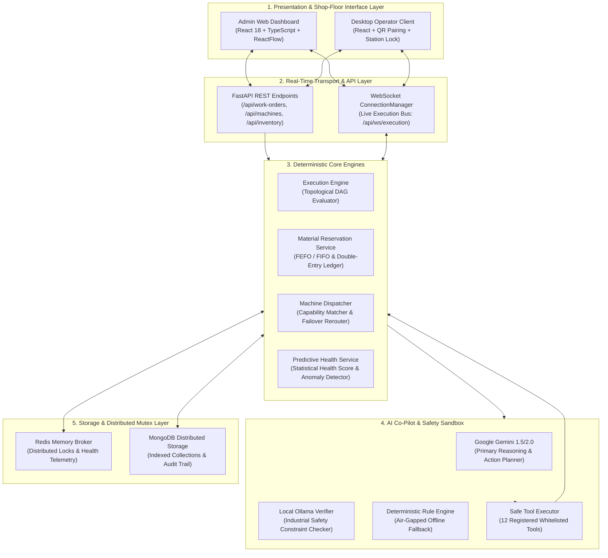
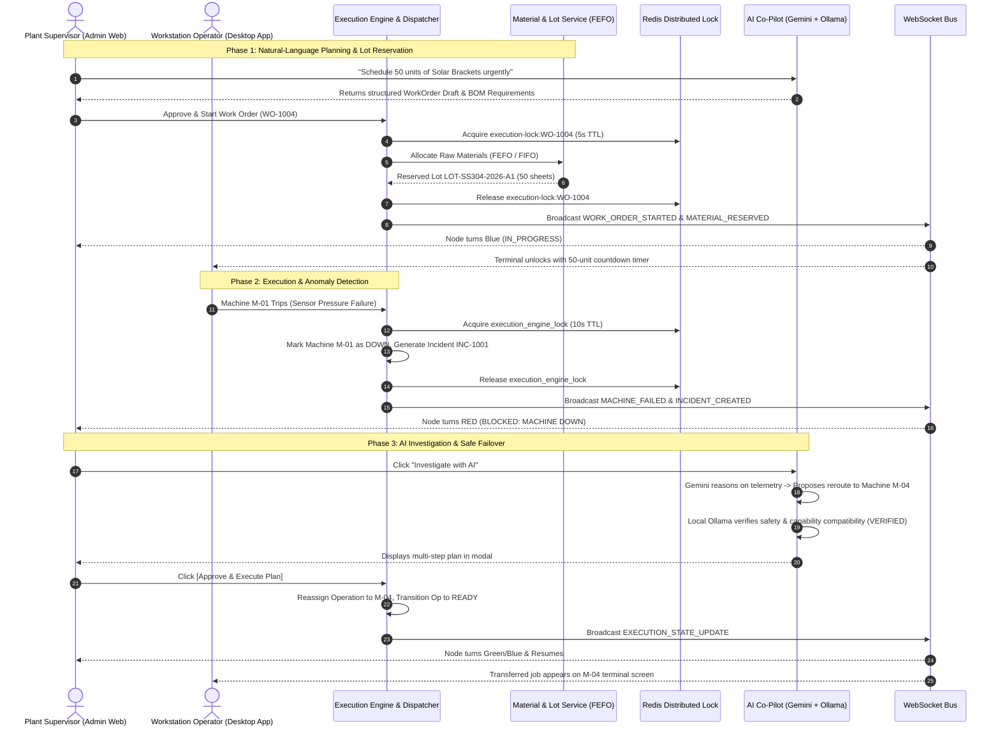

# Adaptive Manufacturing Execution System (MES)
## Master Executive & Architectural System Guide for Technical Evaluators & Judges

---

# 1. Executive Summary & System Philosophy

Traditional Manufacturing Execution Systems (MES) are notoriously rigid: workflows are hardcoded to specific machine serial numbers, raw material tracking lacks atomic lot-level concurrency protection, emergency failovers require manual paper rerouting, and AI integrations often pose severe risks by executing unverified database mutations.

**Adaptive MES** is an enterprise-grade, distributed discrete manufacturing execution platform engineered around **three foundational architectural principles**:

```
+───────────────────────────────────────────────────────────────────────────────────────────────────+
|                                    THE 3 CORE ARCHITECTURAL PILLARS                                |
+───────────────────────────────────────────────────────────────────────────────────────────────────+
|                                                                                                   |
|  1. MATHEMATICALLY DETERMINISTIC EXECUTION                                                        |
|     • Directed Acyclic Graph (DAG) workflow scheduling validated via Depth-First Search (DFS).    |
|     • High-precision FIFO/FEFO raw material lot allocation with atomic Compare-And-Swap locks.    |
|     • Double-entry append-only transaction ledger for 100% forward and backward traceability.     |
|                                                                                                   |
|  2. RESILIENT DISTRIBUTED SYNCHRONIZATION                                                         |
|     • Redis-backed distributed mutex locks preventing race conditions across concurrent loops.    |
|     • Real-time, zero-polling bi-directional WebSocket event bus across all client terminals.     |
|     • In-place state animation on visual DAG canvases without UI re-renders or page flickers.     |
|                                                                                                   |
|  3. SANDBOXED MULTI-TIER AI ORCHESTRATION                                                         |
|     • Zero-Direct-Database-Access architecture: AI operates strictly through 12 registered tools. |
|     • Dual-Model verification: Google Gemini (Primary Reasoning) + Local Ollama (Safety Verifier).|
|     • Mandatory Human-in-the-Loop approval barrier before executing automated shop-floor actions. |
|                                                                                                   |
+───────────────────────────────────────────────────────────────────────────────────────────────────+
```

---

# 2. Complete Plant Ecosystem Architecture

The Adaptive MES ecosystem is divided into five decoupled layers:



---

# 3. Mathematical Models & Operational Formulations

Adaptive MES replaces arbitrary heuristics with strict, provable mathematical formulations across quality, execution time, reliability, and inventory management.

---

## 3.1 Overall Equipment Effectiveness (OEE)
Plant productivity is calculated using standard industrial OEE modeling:

$$\text{OEE} = \text{Availability} \times \text{Performance} \times \text{Quality}$$

Where:

1. **Availability ($A$)**: Measures production time loss due to machine breakdown, maintenance, or material shortage:
   $$A = \frac{\text{Operating Time}}{\text{Planned Production Time}} = \frac{\text{Planned Time} - \text{Total Downtime}}{\text{Planned Time}}$$

2. **Performance ($P$)**: Measures speed loss due to machine wear, minor stops, and cycle time degradation:
   $$P = \frac{\text{Ideal Cycle Time} \times \text{Total Units Produced}}{\text{Operating Time}} = \frac{\text{Configured Processing Rate} \times \text{Total Output}}{\text{Operating Time}}$$

3. **Quality ($Q$)**: Measures yield loss due to defective parts or scrap:
   $$Q = \frac{\text{Good Units Produced}}{\text{Total Units Produced}} = \frac{\text{Total Units Produced} - \text{Scrapped Units}}{\text{Total Units Produced}}$$

---

## 3.2 Predictive Machine Health Scoring ($0 - 100$)
Implemented in `MachineHealthService.calculate_health_score()`, the system evaluates machine sensor telemetry against a statistical baseline and applies a four-factor penalty deduction model:

$$\text{Health Score } (H) = \max\left(0, 100 - \left(P_{\text{cycle}} + P_{\text{failure}} + P_{\text{downtime}} + P_{\text{age}}\right)\right)$$

```
                                  HEALTH SCORE BREAKDOWN (0 - 100)
┌───────────────────────────────┬───────────────────────────────────────────────────────────┬───────────────┐
│ Metric / Penalty Factor       │ Mathematical Condition                                    │ Penalty Range │
├───────────────────────────────┼───────────────────────────────────────────────────────────┼───────────────┤
│ 1. Cycle Time Degradation     │ P_cycle = (CycleDeviationPct - 10%) * 0.8                 │ 0 to 30 pts   │
│ 2. Recent Failure Frequency   │ P_failure = (Failures24h * 15) + (Failures7d * 5)         │ 0 to 35 pts   │
│ 3. Excessive Downtime Ratio   │ P_downtime = (DowntimePct / 100) * 25                     │ 0 to 25 pts   │
│ 4. Operating Age / Wear       │ P_age = (TotalOperatingHours / BaselineWearLife) * 10     │ 0 to 10 pts   │
└───────────────────────────────┴───────────────────────────────────────────────────────────┴───────────────┘
```

### Risk Classification Thresholds:
* **$H \ge 80$**: `LOW` Risk — Standard operational efficiency.
* **$50 \le H < 80$**: `MEDIUM` Risk — Predictive maintenance recommended within 48 hours.
* **$H < 50$**: `HIGH` Risk — Immediate inspection required; automated failover routing prepared.

---

## 3.3 Reliability Metrics: MTBF & MTTR
The platform dynamically calculates factory reliability indicators from the immutable event stream:

$$\text{MTBF (Mean Time Between Failures)} = \frac{\text{Total Operational Seconds}}{\text{Total Number of Breakdown Incidents}}$$

$$\text{MTTR (Mean Time to Repair)} = \frac{\text{Total Breakdown Downtime Seconds}}{\text{Total Number of Breakdown Incidents}}$$

---

## 3.4 Cycle Time & Operation Duration Modeling
When a Work Order is scheduled, operation duration is calculated from the machine's calibrated throughput rate:

$$T_{\text{estimated}} = \left( \frac{\text{Input Quantity}}{\text{Machine Processing Rate (units/sec)}} \right) + T_{\text{setup}}$$

---

## 3.5 Material Lot Costing & Allocation (FEFO/FIFO)
Raw material consumption is priced dynamically at the batch lot level rather than using generic static costs:

$$\text{Actual Batch Cost} = \sum_{i=1}^{n} \left( \text{Quantity Consumed from Lot}_i \times \text{Unit Cost of Lot}_i \right)$$

When consuming materials across multiple lots, the system applies a **pro-rata consumption ratio**:

$$R_{\text{consume}} = \frac{\text{Actual Quantity Consumed}}{\text{Total Quantity Reserved}}$$

$$\text{Lot}_i \text{ Deduction} = \text{Reserved Qty}_i \times R_{\text{consume}}$$

---

# 4. Core Algorithmic Concepts

---

## 4.1 Directed Acyclic Graph (DAG) Validation via DFS 3-Coloring
Workflows represent complex multi-step manufacturing routes (e.g. cutting 2 subcomponents in parallel, bending both, and welding them together). 

To guarantee that workflows never contain **infinite circular dependency deadlocks**, the system runs a Depth-First Search with a recursion stack tracker ($O(V + E)$ complexity) in `WorkflowService.validate_workflow_operations()`:

```
                  DFS RECURSION STACK (rec_stack) CYCLE DETECTION
                  
     [ OP-10 ] ───► [ OP-20 ] ───► [ OP-30 ] ───► [ OP-10 ]  (Circular Loop)
         │              │              │              ▲
         ▼              ▼              ▼              │
    visited: {10}  visited: {10,20} visited: {10,20,30}
    stack:   [10]  stack:   [10,20] stack:   [10,20,30]
                                             │
                                             └──── OP-10 is already in stack!
                                                   BACK-EDGE DETECTED!
                                                   REJECT WORKFLOW (HTTP 400)
```

---

## 4.2 Atomic Compare-And-Swap (CAS) Inventory Allocation
To prevent inventory race conditions (where two operators simultaneously reserve the same 10 sheets of steel when only 10 sheets exist), `MaterialReservationService.allocate_and_reserve()` executes an atomic Compare-And-Swap condition at the database storage engine level:

$$\text{Condition: } \text{QuantityOnHand} - \text{QuantityReserved} \ge \text{QuantityToReserve}$$

If the condition is satisfied, the database atomically increments `quantityReserved`. If insufficient stock exists, all partial allocations are rolled back immediately, and the work order is placed into `WAITING_FOR_MATERIAL`.

---

## 4.3 Zero-Direct-Database-Access AI Tool Sandbox
In Adaptive MES, LLMs (Gemini and Ollama) are **strictly isolated from direct database queries**. The AI operates solely as a high-level cognitive dispatcher:

```
  1. Sanitized JSON Snapshot ──► 2. AI Reasoning ──► 3. Structured Tool JSON ──► 4. Supervisor Barrier ──► 5. Backend Service
  (Machine & Incident Telemetry)   (Root Cause Hypothesis)  (Picks from 12 Safe Tools)   (Human Clicks Approve)   (Deterministic Python Execution)
```

The AI can only propose actions from the whitelisted [`SAFE_TOOL_REGISTRY`](file:///c:/nvm/COLLEGE/INTSH/Vocal/backend/app/ai/tool_registry.py):
* **4 Read-Only Tools**: `get_machine_status`, `get_work_order_execution`, `get_incident_context`, `get_available_resources`.
* **8 State Mutation Tools**: `pause_operation`, `resume_operation`, `reroute_operation`, `mark_machine_down`, `schedule_maintenance`, `resolve_incident`, `stop_work_order`, `create_execution_action_log`.

---

## 4.4 Multi-Tier Hierarchical AI Reliability Architecture
To ensure 100% manufacturing continuity even during cloud network outages:

```
                      INCOMING REASONING TASK
                                 │
                                 ▼
         ┌───────────────────────────────────────────────┐
         │ 1. PRIMARY ENGINE: Google Gemini Cloud API    │
         │ (High-speed multi-step diagnostic reasoning)  │
         └───────────────────────┬───────────────────────┘
                                 │
                   ┌─────────────┴─────────────┐
            Success│                           │ Network / API Outage
                   ▼                           ▼
   ┌──────────────────────────────┐    ┌──────────────────────────────┐
   │ 2. SAFETY VERIFIER:          │    │ 2. OFFLINE LOCAL FALLBACK:   │
   │ Local Ollama LLM             │    │ Local Ollama LLM             │
   │ (Validates safety & locks)   │    │ (Executes reasoning locally) │
   └──────────────┬───────────────┘    └──────────────┬───────────────┘
                  │                                   │
                  │                      Ollama Down /│ Unreachable
                  │                                   ▼
                  │                    ┌──────────────────────────────┐
                  │                    │ 3. HEURISTIC RULE ENGINE:    │
                  │                    │ Hardcoded Deterministic Code │
                  │                    │ (Guarantees zero downtime)   │
                  │                    └──────────────┬───────────────┘
                  │                                   │
                  └─────────────────┬─────────────────┘
                                    │
                                    ▼
                      SUPERVISOR APPROVAL BARRIER
```

---

# 5. Master Subsystem Directory

For granular technical specifications, formulas, flow diagrams, and schema details, refer to the individual subsystem documents in this directory:

| Subsystem Document | Domain | Key Responsibilities |
| :--- | :--- | :--- |
| [**`01_DAG_WORKFLOW_AND_EXECUTION_ENGINE.md`**](./01_DAG_WORKFLOW_AND_EXECUTION_ENGINE.md) | Workflow Engine | DFS cycle checks, topological node progression, machine speed timers. |
| [**`02_MATERIAL_LOT_TRACEABILITY_AND_FEFO.md`**](./02_MATERIAL_LOT_TRACEABILITY_AND_FEFO.md) | Inventory & Supply | FEFO/FIFO lot allocation, CAS reservation locks, double-entry ledger. |
| [**`03_EQUIPMENT_CAPABILITIES_AND_FAILOVER.md`**](./03_EQUIPMENT_CAPABILITIES_AND_FAILOVER.md) | Equipment Dispatch | Standardized capabilities, multi-purpose routing, emergency failovers. |
| [**`04_AI_COPILOT_SANDBOX_AND_DUAL_MODELS.md`**](./04_AI_COPILOT_SANDBOX_AND_DUAL_MODELS.md) | Cognitive Co-Pilot | Gemini + Ollama dual-model architecture, 12 whitelisted tools. |
| [**`05_PREDICTIVE_MAINTENANCE_AND_ANALYTICS.md`**](./05_PREDICTIVE_MAINTENANCE_AND_ANALYTICS.md) | Health Analytics | Health scoring ($0-100$), penalty deductions, cycle elongation tracking. |
| [**`06_REALTIME_SYNCHRONIZATION_AND_REDIS.md`**](./06_REALTIME_SYNCHRONIZATION_AND_REDIS.md) | Infrastructure | Redis distributed mutex locks, WebSocket broadcasting, state sync. |
| [**`07_OPERATOR_CLIENT_AND_STATION_SECURITY.md`**](./07_OPERATOR_CLIENT_AND_STATION_SECURITY.md) | Operator Terminal | QR pairing, 32-byte cryptographic session tokens, station locks. |
| [**`08_INCIDENT_TRIAGE_AND_RCA_PIPELINE.md`**](./08_INCIDENT_TRIAGE_AND_RCA_PIPELINE.md) | Incident Control | Breakdown state machine, severity classification, audit event trails. |
| [**`09_OEE_AND_FACTORY_KPI_ANALYTICS.md`**](./09_OEE_AND_FACTORY_KPI_ANALYTICS.md) | Executive KPIs | Real-time OEE gauges, scrap rate calculation, plant utilization. |

---

# 6. End-to-End Operational Lifecycle (The Complete Plant Journey)

The following sequence illustrates how all nine subsystems coordinate seamlessly during a standard production run and subsequent machine failure triage:



---

# 7. Summary of Technical Innovations for Evaluators

1. **Deterministic Guarantees in Dynamic Environments**: Workflows adapt to machine breakdowns in real-time while strictly preserving mathematical DAG integrity and double-entry inventory balances.
2. **Industrial-Grade Concurrency Safety**: Redis distributed locks eliminate split-brain machine allocations and double material deductions during asynchronous high-frequency execution ticks.
3. **Safe, Explainable Industrial AI**: LLMs are demoted from dangerous direct database actors to governed reasoning advisors bounded by whitelisted tools, secondary safety verification, and human supervisor barriers.
4. **Air-Gapped Operational Resilience**: Multi-tier failover guarantees that manufacturing continues uninterrupted regardless of cloud internet connectivity or external API availability.
