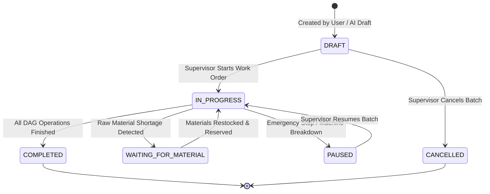
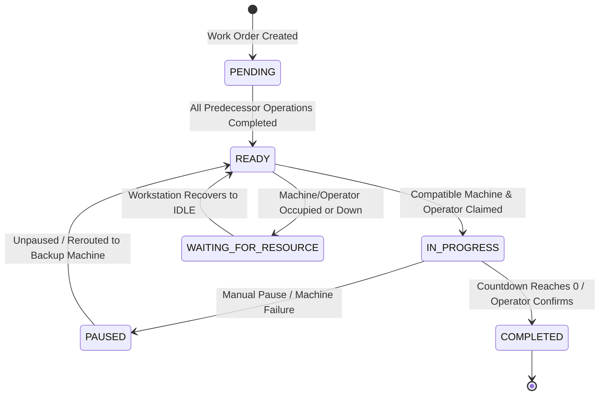
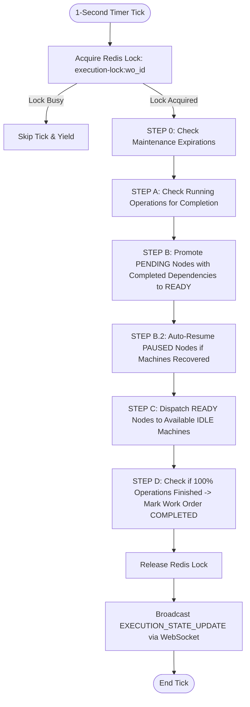

# Subsystem Specification: DAG Workflow & Execution Engine
## Document ID: `01_DAG_WORKFLOW_AND_EXECUTION_ENGINE`

---

# 1. Subsystem Overview & Architectural Purpose

In traditional manufacturing execution systems, production recipes are constrained to rigid, single-threaded linear sequences ($1 \to 2 \to 3 \to 4$). This model fails in modern discrete manufacturing, where products require **parallel subassembly paths, asynchronous quality inspections, and dynamic workstation re-allocation**.

The **Adaptive MES DAG Workflow & Execution Engine** models production routes as **Directed Acyclic Graphs (DAGs)** $G = (V, E)$. It provides:
1. **Mathematical Validation**: Rejection of circular dependencies and deadlocks before database persistence.
2. **Topological Execution**: Automated progression of parallel branches (forks) and multi-parent assemblies (joins).
3. **Deterministic State Transitions**: High-frequency 1-second state machine ticks with microsecond-level rate calculations.
4. **Reactive Visual Streaming**: Real-time push updates to the Admin Web ReactFlow canvas without UI flickering or full-canvas re-renders.

```
+───────────────────────────────────────────────────────────────────────────────────────────────────+
|                                    PARALLEL DAG MANUFACTURING FLOW                                |
+───────────────────────────────────────────────────────────────────────────────────────────────────+
|                                                                                                   |
|                      ┌──► [ OP-10A: Laser Profile Cut (Bay A) ] ──► [ OP-20A: CNC Bending ] ──┐   |
|                      │                                                                        │   |
|  [ RAW MATERIALS ] ──┤                                                                        ├──► [ OP-30: Robotic Welding ] ──► [ OP-40: QA & Coating ]
|                      │                                                                        │
|                      └──► [ OP-10B: Plasma Tube Cut (Bay B) ] ──► [ OP-20B: Deburring ] ──────┘   |
|                                                                                                   |
|                      ◀──────────────── PARALLEL BRANCHES (FORK) ──────────────────────────────▶   |
|                                                                                                   |
+───────────────────────────────────────────────────────────────────────────────────────────────────+
```

---

# 2. Graph Theory & Mathematical Formulations

---

## 2.1 Graph Definition
A manufacturing workflow is formally defined as a finite directed graph:

$$G = (V, E)$$

Where:
* $V = \{Op_1, Op_2, \dots, Op_n\}$ is the set of manufacturing operations (vertices).
* $E = \{(Op_u, Op_v) \mid Op_u, Op_v \in V\}$ is the set of directed precedence constraints (edges), indicating that Operation $Op_u$ must complete before Operation $Op_v$ can begin.

---

## 2.2 In-Degree & Node Promotion Condition
For any operation $Op_v$, let $\text{Predecessors}(Op_v) = \{Op_u \in V \mid (Op_u, Op_v) \in E\}$.

The In-Degree represents the count of prerequisite operations:

$$\text{In-Degree}(Op_v) = |\text{Predecessors}(Op_v)|$$

An operation in the `PENDING` state is promoted to `READY` if and only if **all** of its predecessor nodes have transitioned to `COMPLETED`:

$$\text{CanPromote}(Op_v) \iff \forall Op_u \in \text{Predecessors}(Op_v), \quad \text{Status}(Op_u) = \text{COMPLETED}$$

---

## 2.3 Cycle Detection Algorithm (DFS 3-Coloring / Recursion Stack)
A valid manufacturing workflow must be **acyclic** (no operation can depend on its own eventual completion).

Cycle detection is implemented in `WorkflowService.validate_workflow_operations()` using a **Depth-First Search (DFS) with a recursion call stack** (`rec_stack`), achieving optimal time complexity $\mathcal{O}(|V| + |E|)$:

```
                               DFS RECURSION STACK CYCLE DETECTION
                               
  Input: Adjacency List `graph` mapping each node to its `dependencies`.
  
  Let visited = {}      (Set of globally processed nodes)
  Let rec_stack = {}    (Set of nodes in current active recursion path)

  For each node v in V:
      If v not in visited:
          If DFS_VISIT(v) == TRUE:
              Output "Circular dependency cycle detected"
              Return INVALID

  Function DFS_VISIT(u):
      visited.add(u)
      rec_stack.add(u)
      
      For each neighbor w in graph[u]:
          If w not in visited:
              If DFS_VISIT(w) == TRUE:
                  Return TRUE
          Else If w in rec_stack:
              // Back-edge found! A path exists from u back to an ancestor w.
              Record Cycle Path (e.g., u -> ... -> w -> u)
              Return TRUE
              
      rec_stack.remove(u)  // Backtrack
      Return FALSE
```

---

## 2.4 Operation Duration & Machine Rate Formulations
When an operation starts, its expected completion timestamp is determined by the calibrated physical throughput rate of the assigned machine:

$$T_{\text{cycle}} = \frac{1}{\text{Processing Rate (units/sec)}}$$

$$T_{\text{duration}} = \left( \text{Input Quantity} \times T_{\text{cycle}} \right) + T_{\text{setup}}$$

$$\text{EstimatedCompletionAt} = \text{StartedAt} + T_{\text{duration}}$$

$$\text{RemainingSeconds} = \max\left(0, \left\lceil \text{EstimatedCompletionAt} - \text{CurrentTimestamp} \right\rceil\right)$$

---

## 2.5 Dynamic Input Quantity Propagation (Join Resolution)
When multiple parallel branches merge into a single assembly node (e.g. welding two subcomponents together), the input quantity available to the assembly node is governed by the limiting predecessor:

$$\text{InputQuantity}(Op_{\text{join}}) = \min_{Op_u \in \text{Predecessors}(Op_{\text{join}})} \left( \text{OutputQuantity}(Op_u) \right)$$

---

# 3. State Machine Architecture

Adaptive MES maintains two tightly synchronized state machines: the **Work Order Macro-State Machine** and the **Operation Micro-State Machine**.

---

## 3.1 Work Order Lifecycle



| Work Order Status | Operational Meaning | Machine & Material State |
| :--- | :--- | :--- |
| `DRAFT` | Recipe designed; not yet released to shop floor. | No machines locked; no materials reserved. |
| `IN_PROGRESS` | Actively executing on the factory floor. | Machines assigned; lots locked via CAS. |
| `WAITING_FOR_MATERIAL` | Stalled due to insufficient warehouse stock. | Preceding locks released; auto-retry enabled. |
| `PAUSED` | Halted by supervisor or automated safety interlock. | Active machine timers paused. |
| `COMPLETED` | 100% of DAG operations finished successfully. | All machines released; materials consumed to ledger. |
| `CANCELLED` | Batch aborted before completion. | All reservations released; machines returned to `IDLE`. |

---

## 3.2 Operation Node Lifecycle & Visual Representation

Each node on the ReactFlow canvas transitions through well-defined operational states reflected by distinct UI styling:



```
                                 REACTFLOW NODE VISUAL SPECIFICATION
┌───────────────────────────┬───────────────────────┬────────────────────────────────────────────────────────┐
│ Operation Node Status     │ Node Border / Badge   │ Visual UI Indicator on ReactFlow Canvas                │
├───────────────────────────┼───────────────────────┼────────────────────────────────────────────────────────┤
│ `PENDING`                 │ Gray (Zinc-400)       │ "Waiting for upstream operations to complete"          │
│ `READY`                   │ Blue (Sky-500)        │ "Ready to execute — claiming workstation..."           │
│ `IN_PROGRESS`             │ Pulsing Indigo-600    │ Live countdown timer (e.g. "42s remaining") + Bar      │
│ `WAITING_FOR_MATERIAL`    │ Amber (Yellow-500)    │ Warning Banner: "[WAITING FOR MATERIAL: SS304 Sheet]"  │
│ `WAITING_FOR_RESOURCE`    │ Purple (Violet-500)   │ Warning Banner: "[OCCUPIED: Waiting for Machine M-01]" │
│ `PAUSED`                  │ Red (Rose-600)        │ Hazard Banner: "[BLOCKED: MACHINE DOWN]" + Resume Btn  │
│ `COMPLETED`               │ Green (Emerald-500)   │ Checkmark Icon + Final Processed Quantity Badge        │
└───────────────────────────┴───────────────────────┴────────────────────────────────────────────────────────┘
```

---

# 4. Core Execution Engine Loop (The 1-Second Dispatcher)

The Execution Engine runs an asynchronous background evaluation loop every 1,000 milliseconds in [`ExecutionEngine.evaluate_execution()`](file:///c:/nvm/COLLEGE/INTSH/Vocal/backend/app/services/execution_engine.py#L195-L700).



---

## Step-by-Step Execution Mechanics:

### Step 0: Maintenance Window Recovery
* Queries `db.machines` where `status == "MAINTENANCE"` and `maintenanceEstimatedEnd <= now`.
* Automatically recovers machine to `IDLE` and marks associated incident as `RESOLVED`.

### Step A: Operation Completion Evaluation
* For operations with `status == "IN_PROGRESS"`:
  * Checks if `now >= estimatedCompletionAt`.
  * Releases assigned machine back to `IDLE` and logs `MACHINE_RELEASED`.
  * Releases assigned operator back to `AVAILABLE` and logs `OPERATOR_RELEASED`.
  * Converts reserved materials into permanent consumption via `MaterialReservationService.consume_for_operation()`.
  * Marks operation `COMPLETED`.

### Step B: Topological Dependency Resolution
* Gathers the set of all completed operation IDs.
* For all `PENDING` operations, checks if `dependencies \subseteq completed_op_ids`.
* Calculates incoming `inputQuantity` from predecessor outputs.
* Promotes operation status to `READY`.

### Step B.2: Auto-Recovery of Interrupted Nodes
* Inspects `PAUSED` operations. If the assigned machine (or an alternative compatible workstation) has become `IDLE`, automatically transitions the operation back to `READY` and clears the blockage reason.

### Step C: Resource Allocation & Countdown Initialization
* For `READY` operations:
  * Checks machine availability. If machine is `IDLE`, transitions machine to `OCCUPIED`.
  * Calculates `estimatedCompletionAt` based on machine speed rate.
  * Transitions operation to `IN_PROGRESS`.
  * Emits `OPERATION_STARTED` audit event.

### Step D: Work Order Finalization
* If all operations in the DAG are `COMPLETED`, transitions the Work Order status to `COMPLETED` and sets `completedAt = now`.

---

# 5. Key Functions & Component Architecture

---

## 5.1 Backend Services

### 1. `WorkflowService.validate_workflow_operations(operations: List[dict])`
* **File**: [`backend/app/services/workflow_service.py`](file:///c:/nvm/COLLEGE/INTSH/Vocal/backend/app/services/workflow_service.py#L42-L160)
* **Functionality**: Validates operation uniqueness, non-empty IDs, valid sequence numbers, capability references, self-dependency prevention, dangling reference prevention, and runs the DFS recursion stack cycle detection algorithm.

### 2. `WorkflowService.auto_assign_resources(operations: List[dict])`
* **File**: [`backend/app/services/workflow_service.py`](file:///c:/nvm/COLLEGE/INTSH/Vocal/backend/app/services/workflow_service.py#L162-L210)
* **Functionality**: Matches unassigned operations to physical factory workstations by intersecting `requiredCapabilityIds` and `requiredMachineType` against available plant equipment.

### 3. `ExecutionEngine.evaluate_execution(work_order_id: str)`
* **File**: [`backend/app/services/execution_engine.py`](file:///c:/nvm/COLLEGE/INTSH/Vocal/backend/app/services/execution_engine.py#L195-L700)
* **Functionality**: The core 1-second state machine evaluator. Acquires Redis mutex lock, checks maintenance timers, resolves topological prerequisites, claims workstations, and decrements countdowns.

### 4. `ExecutionEngine.log_execution_event()`
* **File**: [`backend/app/services/execution_engine.py`](file:///c:/nvm/COLLEGE/INTSH/Vocal/backend/app/services/execution_engine.py#L45-L95)
* **Functionality**: Appends an immutable structured record into `db.executions.events` and emits real-time WebSocket payloads.

---

## 5.2 Frontend Components

### 1. `WorkflowDesignerPage.tsx`
* **File**: [`admin-web/src/pages/WorkflowDesignerPage.tsx`](file:///c:/nvm/COLLEGE/INTSH/Vocal/admin-web/src/pages/WorkflowDesignerPage.tsx)
* **Functionality**: Interactive ReactFlow canvas. Subscribes to `EXECUTION_STATE_UPDATE` WebSocket events. Uses a dedicated node status map to update countdown timers, progress bars, and blockage banners in-place without triggering full canvas layout recalculations.

### 2. `WorkOrdersPage.tsx`
* **File**: [`admin-web/src/pages/WorkOrdersPage.tsx`](file:///c:/nvm/COLLEGE/INTSH/Vocal/admin-web/src/pages/WorkOrdersPage.tsx)
* **Functionality**: Grid view of all planned, running, and completed manufacturing batches. Displays step status pills, actual vs estimated durations, and live costing breakdowns.

---

# 6. Edge Cases & Resilience Safeguards

1. **Self-Loop Submission ($V \to V$)**: Caught at validation time; returns `400 Bad Request: Operation 'OP-10' cannot depend on itself`.
2. **Disconnected Island Nodes**: Validated to ensure standalone operations can execute in parallel from time zero without blocking the main workflow.
3. **Mid-Flight Machine Failure**: If a workstation fails during `IN_PROGRESS`, the operation is transitioned to `PAUSED`, the machine is tagged `DOWN`, and the node displays `[BLOCKED: MACHINE DOWN]` with an interactive `[Resume Node]` button that allows immediate rerouting to an idle backup workstation.
4. **Asynchronous Race Conditions**: The entire evaluation pass is protected by Redis `execution-lock:{wo_id}`, guaranteeing that manual supervisor pause clicks and automated 1-second ticks never execute concurrently.
