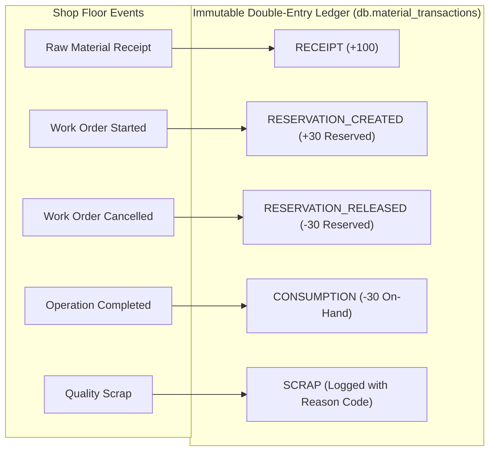
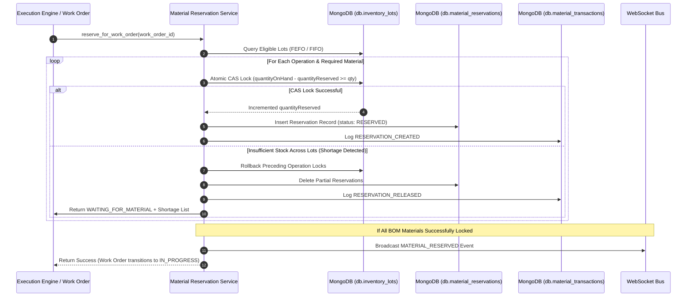

# Subsystem Specification: Raw Material Lot Traceability, FEFO/FIFO Allocation & Double-Entry Ledger
## Document ID: `02_MATERIAL_LOT_TRACEABILITY_AND_FEFO`

---

# 1. Subsystem Overview & Industrial Significance

In discrete manufacturing and safety-critical industries (automotive, aerospace, medical devices), tracking raw material inventory as a simple single number (e.g. *"We have 100 sheets of steel"*) is unacceptable. 

Raw materials arrive in distinct physical **Lots and Batches**, each with unique metallurgical properties, supplier certificates, heat numbers, storage bin locations, unit costs, and expiration dates. If a finished product fails in the field, plant engineers must be able to trace **backward** from the finished serial number to the exact steel heat lot, and **forward** to identify all other batches manufactured with that same contaminated lot.

The **Adaptive MES Material Traceability Subsystem** provides:
1. **Granular Lot-Level Tracking**: Full metallurgical heat and supplier batch tracking per physical lot.
2. **Deterministic FEFO / FIFO Allocation**: Automated inventory locking prioritizing expiring lots first, followed by oldest received lots.
3. **Atomic Compare-And-Swap (CAS) Concurrency Protection**: Database-level atomic conditional locking that eliminates double-allocation race conditions.
4. **All-or-Nothing Shortage Rollback**: Automatic release of partial locks if warehouse stock is insufficient for a work order BOM.
5. **Double-Entry Append-Only Material Ledger**: Immutable audit trail recording every receipt, reservation, release, consumption, and scrap event.

```
+───────────────────────────────────────────────────────────────────────────────────────────────────+
|                                    INVENTORY LOT ARCHITECTURE                                     |
+───────────────────────────────────────────────────────────────────────────────────────────────────+
|                                                                                                   |
|  MATERIAL DEFINITION (MAT-SS-304: Stainless Steel Sheet 2mm)                                      |
|  │                                                                                                |
|  ├──► LOT-SS304-2026-A1 (Heat #HT-9821, Bay A-01, Expiry: 2027-01-01)                             |
|  │    ├── quantityOnHand: 100.0   (Total physical units in warehouse)                             |
|  │    ├── quantityReserved: 30.0  (Locked for Work Order WO-1004)                                 |
|  │    └── quantityAvailable: 70.0 (Available for new work orders)                                 |
|  │                                                                                                |
|  └──► LOT-SS304-2026-B2 (Heat #HT-9940, Bay A-02, Expiry: 2026-11-01) ───► FEFO Priority 1st!     |
|       ├── quantityOnHand: 50.0                                                                    |
|       ├── quantityReserved: 0.0                                                                   |
|       └── quantityAvailable: 50.0                                                                 |
|                                                                                                   |
+───────────────────────────────────────────────────────────────────────────────────────────────────+
```

---

# 2. Mathematical Models & Allocation Formulations

---

## 2.1 Dynamic Stock Balance Equation
Physical stock balances are computed through a three-variable inventory equation. The available stock is a **dynamic property** that is never stored independently to prevent synchronization drifts:

$$\text{QuantityAvailable} = \max\left(0, \quad \text{QuantityOnHand} - \text{QuantityReserved}\right)$$

Where:
* $\text{QuantityOnHand} \ge 0$: Total physical stock physically located in the warehouse bays.
* $\text{QuantityReserved} \ge 0$: Stock earmarked and locked for active or planned work orders.
* $\text{QuantityAvailable}$: Net uncommitted stock that can be allocated to new production orders.

---

## 2.2 FEFO / FIFO Sorting Key Formulation
When an operation requires raw materials, eligible lots are fetched where:

$$\text{Status} = \text{AVAILABLE} \quad \land \quad (\text{ExpiryDate} = \text{None} \lor \text{ExpiryDate} > \text{CurrentTimestamp})$$

The allocation engine sorts eligible lots using a compound tuple key in `MaterialReservationService.allocate_and_reserve()`:

$$\text{SortKey}(\text{Lot}) = \Big( \text{ExpiryDate} \;\lor\; \infty, \quad \text{ReceivedDate} \;\lor\; 0, \quad \text{LotId} \Big)$$

1. **FEFO Tier (First-Expiring, First-Out)**: Lots with defined expiration dates are prioritized in ascending order of `ExpiryDate` to minimize shelf-life spoilage.
2. **FIFO Tier (First-In, First-Out)**: For non-perishable lots (where `ExpiryDate` is `None`), lots are sorted in ascending order of `ReceivedDate` (oldest warehouse receipts first).
3. **Deterministic Tie-Breaker**: Lexicographical sorting on `LotId` ensures 100% deterministic allocations across multiple backend workers.

---

## 2.3 Atomic Compare-And-Swap (CAS) Allocation Formula
To guarantee that two concurrent work orders cannot reserve the same inventory simultaneously, the engine executes an atomic Compare-And-Swap update at the database layer:

$$\text{Condition: } \Big( \text{QuantityOnHand} - \text{QuantityReserved} \Big) \ge \text{QuantityToReserve}$$

$$\text{Mutation: } \text{QuantityReserved} \leftarrow \text{QuantityReserved} + \text{QuantityToReserve}$$

If the condition fails for a given lot, the atomic update returns null, and the engine moves to the next eligible lot in the priority queue.

---

## 2.4 Pro-Rata Multi-Lot Consumption Formula
When an operation completes, actual material consumption may differ slightly from the planned BOM reservation (due to yield variations). When a reservation spans multiple lots, actual consumption is deducted **pro-rata across the allocated lots**:

$$\text{TotalReserved} = \sum_{i=1}^{m} \text{QuantityReserved}_i$$

$$\text{Consumption Ratio } (R_{\text{consume}}) = \begin{cases} \frac{\text{ActualQuantityConsumed}}{\text{TotalReserved}} & \text{if } \text{TotalReserved} > 0 \\ 1.0 & \text{otherwise} \end{cases}$$

$$\text{Lot}_i \text{ Deduction} = \text{QuantityReserved}_i \times R_{\text{consume}}$$

Physical stock and reserved stock on each lot are updated simultaneously:

$$\text{New QuantityOnHand}_i = \text{Previous QuantityOnHand}_i - \left(\text{QuantityReserved}_i \times R_{\text{consume}}\right)$$

$$\text{New QuantityReserved}_i = \text{Previous QuantityReserved}_i - \text{QuantityReserved}_i$$

---

## 2.5 Actual Batch Costing Formulation
Unlike legacy systems that use static average costs, Adaptive MES calculates the **exact acquisition cost** of each manufacturing batch from the specific lots consumed:

$$\text{Actual Batch Material Cost} = \sum_{i=1}^{m} \Big( \text{Consumed Quantity from Lot}_i \times \text{Unit Cost of Lot}_i \Big)$$

---

# 3. Double-Entry Material Transaction Ledger

Every physical movement, reservation, release, or scrap event generates an immutable, append-only record in `db.material_transactions`.



### Ledger Transaction Types:
1. **`RECEIPT`**: New physical stock received into a warehouse lot from a vendor. Increments `quantityOnHand`.
2. **`RESERVATION_CREATED`**: Stock locked for an upcoming work order operation. Increments `quantityReserved`.
3. **`RESERVATION_RELEASED`**: Locked stock released due to work order cancellation or shortage rollback. Decrements `quantityReserved`.
4. **`CONSUMPTION`**: Raw material permanently converted into a work-in-progress (WIP) or finished part. Decrements both `quantityOnHand` and `quantityReserved`.
5. **`SCRAP`**: Material damaged or discarded due to defect. Records scrap quantity and standard reason codes (`MATERIAL_DEFECT`, `MACHINE_MALFUNCTION`, `OPERATOR_ERROR`, `TOOLING_FAILURE`, `OTHER`).
6. **`ADJUSTMENT`**: Physical cycle count audit reconciliation.

---

# 4. End-to-End Allocation & Reservation Flow



---

# 5. Supply Chain Traceability (Forward & Backward Genealogy)

Adaptive MES provides bidirectional genealogy lookups in `MaterialTransactionService`:

```
+───────────────────────────────────────────────────────────────────────────────────────────────────+
|                                    SUPPLY CHAIN TRACEABILITY                                      |
+───────────────────────────────────────────────────────────────────────────────────────────────────+
|                                                                                                   |
|  1. BACKWARD TRACEABILITY (Genealogy Root Cause Analysis)                                         |
|     Finished Product Serial: "SN-SOLAR-BRACKET-1004"                                              |
|     └── Work Order: WO-1004                                                                       |
|         ├── Operation OP-10 (Laser Cutting) ──► Used Lot: LOT-SS304-2026-A1                       |
|         │                                       ├── Supplier: "Acme Metals Corp"                  |
|         │                                       ├── Heat Number: "HT-9821"                        |
|         │                                       └── Storage Bay: "Bay A-01"                       |
|         └── Operation OP-30 (Robotic Welding) ──► Used Lot: LOT-WELD-ROD-404                      |
|                                                 └── Heat Number: "HT-W8832"                       |
|                                                                                                   |
|  2. FORWARD TRACEABILITY (Containment & Recall Analysis)                                          |
|     Contaminated Lot: LOT-SS304-2026-A1 (Defective Tensile Strength)                              |
|     └── Traced Downstream Work Orders:                                                            |
|         ├── WO-1001 (50 Units Manufactured ──► Shipped to Customer ABC) [RECALL NOTICE]           |
|         ├── WO-1004 (10 Units In-Progress ──► Paused on Shop Floor) [CONTAINMENT LOCK]            |
|         └── WO-1008 (Planned ──► Released Reservations & Swapped Lot) [PREVENTATIVE ACTION]       |
|                                                                                                   |
+───────────────────────────────────────────────────────────────────────────────────────────────────+
```

---

# 6. Key Functions & Component Directory

---

## 6.1 Service Layer

### 1. `MaterialReservationService.allocate_and_reserve()`
* **File**: [`backend/app/services/material_reservation_service.py`](file:///c:/nvm/COLLEGE/INTSH/Vocal/backend/app/services/material_reservation_service.py#L19-L173)
* **Functionality**: Performs FEFO/FIFO sorting, executes atomic Compare-And-Swap reservation locks against inventory lots, logs ledger events, and executes automatic all-or-nothing rollbacks on material shortages.

### 2. `MaterialReservationService.reserve_for_work_order()`
* **File**: [`backend/app/services/material_reservation_service.py`](file:///c:/nvm/COLLEGE/INTSH/Vocal/backend/app/services/material_reservation_service.py#L175-L320)
* **Functionality**: Evaluates the complete Bill of Materials (BOM) across all operations in a Work Order. Locks stock or transitions the batch to `WAITING_FOR_MATERIAL`.

### 3. `MaterialReservationService.consume_for_operation()`
* **File**: [`backend/app/services/material_reservation_service.py`](file:///c:/nvm/COLLEGE/INTSH/Vocal/backend/app/services/material_reservation_service.py#L323-L450)
* **Functionality**: Converts active reservations into permanent consumption upon operation completion. Atomically decrements `quantityOnHand` and `quantityReserved`, calculates actual lot-level costs, and logs scrap.

### 4. `MaterialTransactionService.log_transaction()`
* **File**: [`backend/app/services/material_transaction_service.py`](file:///c:/nvm/COLLEGE/INTSH/Vocal/backend/app/services/material_transaction_service.py#L18-L75)
* **Functionality**: Writes immutable audit ledger records for every inventory movement.

### 5. `MaterialTransactionService.trace_forward()` & `trace_backward()`
* **File**: [`backend/app/services/material_transaction_service.py`](file:///c:/nvm/COLLEGE/INTSH/Vocal/backend/app/services/material_transaction_service.py#L80-L150)
* **Functionality**: Computes full supply chain genealogy trees for defect containment and customer recall reporting.

---

## 6.2 Frontend Components

### 1. `MaterialsPage.tsx`
* **File**: [`admin-web/src/pages/MaterialsPage.tsx`](file:///c:/nvm/COLLEGE/INTSH/Vocal/admin-web/src/pages/MaterialsPage.tsx)
* **Functionality**: Warehouse material management view. Displays catalog items, aggregate stock levels, inventory valuation, and storage locations.

### 2. `InventoryLotsModal.tsx`
* **File**: [`admin-web/src/components/InventoryLotsModal.tsx`](file:///c:/nvm/COLLEGE/INTSH/Vocal/admin-web/src/components/InventoryLotsModal.tsx)
* **Functionality**: Granular lot inspector. Displays physical `quantityOnHand`, locked `quantityReserved`, net `quantityAvailable`, heat numbers, expiry alerts, and lot receipt controls.
