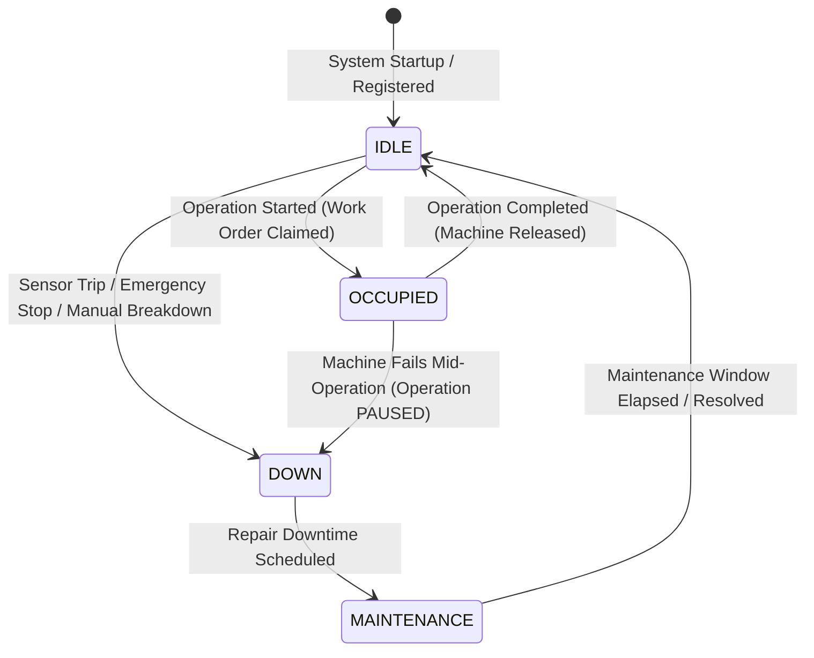
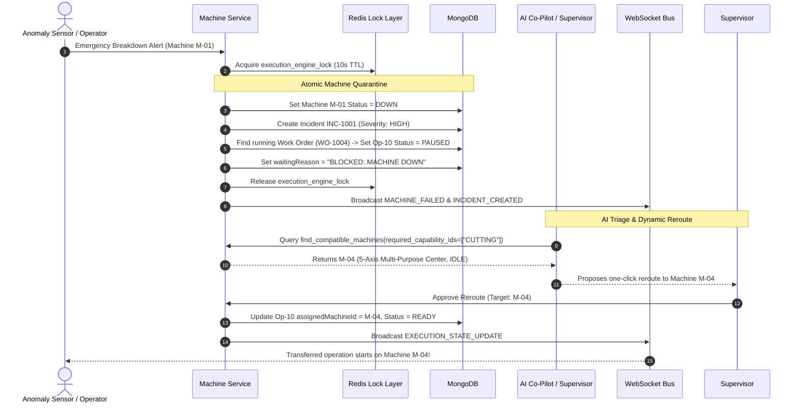

# Subsystem Specification: Standardized Capabilities, Workstation Dispatch & Dynamic Failover
## Document ID: `03_EQUIPMENT_CAPABILITIES_AND_FAILOVER`

---

# 1. Subsystem Overview & Industrial Significance

In legacy manufacturing environments, production recipes are tightly coupled to specific machine serial numbers (e.g. *"Operation 10 MUST run on Laser Cutter #1"*). If Laser Cutter #1 suffers a mechanical breakdown, production halts entirely, causing catastrophic downtime, stranded WIP inventory, and missed shipping deadlines.

The **Adaptive MES Equipment Dispatch & Capability Subsystem** solves this vulnerability by introducing an **abstracted capability-based routing architecture**. 

Instead of binding operations to hardware serial numbers, manufacturing workflows specify the **required capabilities and tolerances**. The dispatch engine dynamically matches operations to available physical machines, automatically routes work around breakdowns, and enables seamless multi-purpose workstation sharing.

```
+───────────────────────────────────────────────────────────────────────────────────────────────────+
|                                  CAPABILITY-BASED DISPATCH MODEL                                  |
+───────────────────────────────────────────────────────────────────────────────────────────────────+
|                                                                                                   |
|   WORKFLOW REQUIREMENT                              AVAILABLE FACTORY MACHINES                    |
|                                                                                                   |
|   Operation OP-10: "Laser Cutting"                  M-01: Fiber Laser Cutter                      |
|   ├── requiredMachineType: "CUTTING"                ├── type: "CUTTING"                           |
|   └── requiredCapabilities: [ "CUTTING" ] ────────► └── capabilityIds: [ "CUTTING" ] (Primary)    |
|                                                     │                                             |
|                                                     │ Breakdown! (M-01 marked DOWN)               |
|                                                     ▼                                             |
|                                                     M-04: 5-Axis CNC Machining Center             |
|                                                     ├── type: "MULTI_PURPOSE"                     |
|                                                     ├── supportedTypes: ["CUTTING", "MILLING"]    |
|                                                     └── capabilityIds: ["CUTTING", "MILLING"]     |
|                                                         (AUTOMATED BACKUP FAILOVER!)              |
|                                                                                                   |
+───────────────────────────────────────────────────────────────────────────────────────────────────+
```

---

# 2. Mathematical & Set-Theoretic Matching Formulations

---

## 2.1 Standard Manufacturing Capabilities
A **Capability** represents a standardized manufacturing process qualification registered in `db.capabilities`:

$$\mathcal{C} = \{\text{CUTTING}, \text{BENDING}, \text{WELDING}, \text{MILLING}, \text{PAINTING}, \text{INSPECTION}\}$$

Each physical machine $M$ is configured with a set of supported capability IDs:

$$\text{Capabilities}(M) \subseteq \mathcal{C}$$

---

## 2.2 Multi-Constraint Machine Compatibility Rule
For an operation $Op$ requiring machine type $T_{req}$ and capability set $\mathcal{C}_{req} \subseteq \mathcal{C}$, a physical machine $M$ is considered **compatible** if and only if both the **Type Constraint** and the **Capability Constraint** are satisfied simultaneously:

$$\text{IsCompatible}(M, Op) \iff \text{TypeMatch}(M, Op) \quad \land \quad \text{CapabilityMatch}(M, Op)$$

### 1. Type Match Condition (Supporting Dedicated & Multi-Purpose Machines):
$$\text{TypeMatch}(M, Op) \iff \Big( \text{Type}(M) = T_{req} \Big) \;\lor\; \Big( \text{Type}(M) = \text{"MULTI\_PURPOSE"} \;\land\; T_{req} \in \text{SupportedTypes}(M) \Big)$$

### 2. Capability Subset Condition:
$$\text{CapabilityMatch}(M, Op) \iff \mathcal{C}_{req} \subseteq \text{Capabilities}(M)$$

$$\forall c \in \mathcal{C}_{req}, \quad c \in \text{Capabilities}(M)$$

---

## 2.3 Optimal Machine Selection Function (Throughput Maximization)
When multiple compatible machines are idle and available, the dispatch engine selects the machine that maximizes manufacturing throughput:

$$M^* = \arg\max_{M \in \text{CompatibleAvailable}(Op)} \Big( \text{ProcessingRate}(M) \Big)$$

Where:
$$\text{CompatibleAvailable}(Op) = \{M \in \mathcal{M} \mid \text{IsCompatible}(M, Op) \land \text{Status}(M) = \text{IDLE} \land \text{Availability}(M) = \text{True}\}$$

$$\text{ProcessingRate}(M) = \text{Configured Throughput Rate (units/second)}$$

---

# 3. Workstation State Machine Lifecycle

Every factory workstation transitions through four mutually exclusive operational states:



```
                                  WORKSTATION STATUS SPECIFICATION
┌───────────────────┬───────────────────┬────────────────────────────────────────────────────────────┐
│ Machine Status    │ Card UI Color     │ Operational Meaning & Engine Behavior                      │
├───────────────────┼───────────────────┼────────────────────────────────────────────────────────────┤
│ `IDLE`            │ Green (Emerald)   │ Workstation is healthy, calibrated, and ready for work.    │
│ `OCCUPIED`        │ Blue (Sky)        │ Workstation is actively running a batch; locked in Redis.  │
│ `DOWN`            │ Red (Rose)        │ Emergency breakdown or safety stop; blocked from dispatch. │
│ `MAINTENANCE`     │ Amber (Yellow)    │ Workstation undergoing scheduled repair; countdown active. │
└───────────────────┴───────────────────┴────────────────────────────────────────────────────────────┘
```

---

# 4. Emergency Breakdown & Dynamic Failover Pipeline

When a physical machine fails, the system executes an atomic 6-stage failover pipeline in `MachineService.fail_machine()`:



---

# 5. Scheduled Maintenance & Auto-Recovery Engine

Adaptive MES features an automated maintenance scheduler that eliminates manual supervisor intervention for routine repairs:

```
+───────────────────────────────────────────────────────────────────────────────────────────────────+
|                                MAINTENANCE AUTO-RECOVERY TIMELINE                                 |
+───────────────────────────────────────────────────────────────────────────────────────────────────+
|                                                                                                   |
|  12:00 PM: Maintenance Scheduled on Machine M-02 (Duration: 30 minutes)                          |
|  ├── Status updated to: "MAINTENANCE"                                                             |
|  ├── maintenanceWindow: { start: 12:00 PM, duration: 30m, estimatedEnd: 12:30 PM }                |
|  └── Active incident INC-1002 marked: "MAINTENANCE_IN_PROGRESS"                                   |
|                                                                                                   |
|  12:00 PM -> 12:30 PM: System Execution Loop runs 1-second ticks                                  |
|  └── Ignores M-02 during dispatch (status != IDLE)                                                |
|                                                                                                   |
|  12:30:01 PM: Background Engine Loop evaluates Step 0:                                            |
|  ├── Detects: maintenanceEstimatedEnd (12:30:00) <= now (12:30:01)                                |
|  ├── Calls: MachineService.recover_machine(M-02)                                                  |
|  ├── Machine M-02 status automatically restored to "IDLE"                                         |
|  ├── Incident INC-1002 automatically closed: "RESOLVED (Auto-recovered)"                          |
|  └── Broadcasts: MACHINE_RECOVERED (M-02 is immediately eligible for new jobs!)                   |
|                                                                                                   |
+───────────────────────────────────────────────────────────────────────────────────────────────────+
```

---

# 6. Key Functions & Component Directory

---

## 6.1 Service Layer

### 1. `MachineService.find_compatible_machines()`
* **File**: [`backend/app/services/machine_service.py`](file:///c:/nvm/COLLEGE/INTSH/Vocal/backend/app/services/machine_service.py#L121-L156)
* **Parameters**: `required_capability_ids: Optional[List[str]]`, `required_machine_type: Optional[str]`, `only_available: bool = False`.
* **Functionality**: Intersects capability sets, verifies multi-purpose supported type lists, and filters by availability status.

### 2. `MachineService.fail_machine()`
* **File**: [`backend/app/services/machine_service.py`](file:///c:/nvm/COLLEGE/INTSH/Vocal/backend/app/services/machine_service.py#L318-L530)
* **Functionality**: Acquires global `execution_engine_lock`, marks workstation `DOWN`, pauses affected work order batches, generates incident records, and broadcasts alerts over WebSockets.

### 3. `MachineService.recover_machine()`
* **File**: [`backend/app/services/machine_service.py`](file:///c:/nvm/COLLEGE/INTSH/Vocal/backend/app/services/machine_service.py#L532-L560)
* **Functionality**: Restores workstation from `DOWN` or `MAINTENANCE` back to `IDLE`, clears incident locks, and makes the machine available for immediate dispatch.

### 4. `MachineService.schedule_maintenance()`
* **File**: [`backend/app/services/machine_service.py`](file:///c:/nvm/COLLEGE/INTSH/Vocal/backend/app/services/machine_service.py#L562-L610)
* **Functionality**: Transitions machine to `MAINTENANCE`, initializes estimated end countdown timers, and logs maintenance audit events.

### 5. `CapabilityService.create_capability()` & `list_capabilities()`
* **File**: [`backend/app/services/capability_service.py`](file:///c:/nvm/COLLEGE/INTSH/Vocal/backend/app/services/capability_service.py#L10-L60)
* **Functionality**: CRUD management for standardized manufacturing process qualifications.

---

## 6.2 Frontend Components

### 1. `MachinesPage.tsx`
* **File**: [`admin-web/src/pages/MachinesPage.tsx`](file:///c:/nvm/COLLEGE/INTSH/Vocal/admin-web/src/pages/MachinesPage.tsx)
* **Functionality**: Digital twin grid of all plant workstations. Displays live occupancy status, current work order codes, configured processing rates, and quick action buttons for breakdown simulation and maintenance scheduling.

### 2. `CapabilitiesPage.tsx`
* **File**: [`admin-web/src/pages/CapabilitiesPage.tsx`](file:///c:/nvm/COLLEGE/INTSH/Vocal/admin-web/src/pages/CapabilitiesPage.tsx)
* **Functionality**: Management portal for plant-wide manufacturing capabilities, descriptions, and linked equipment lists.
