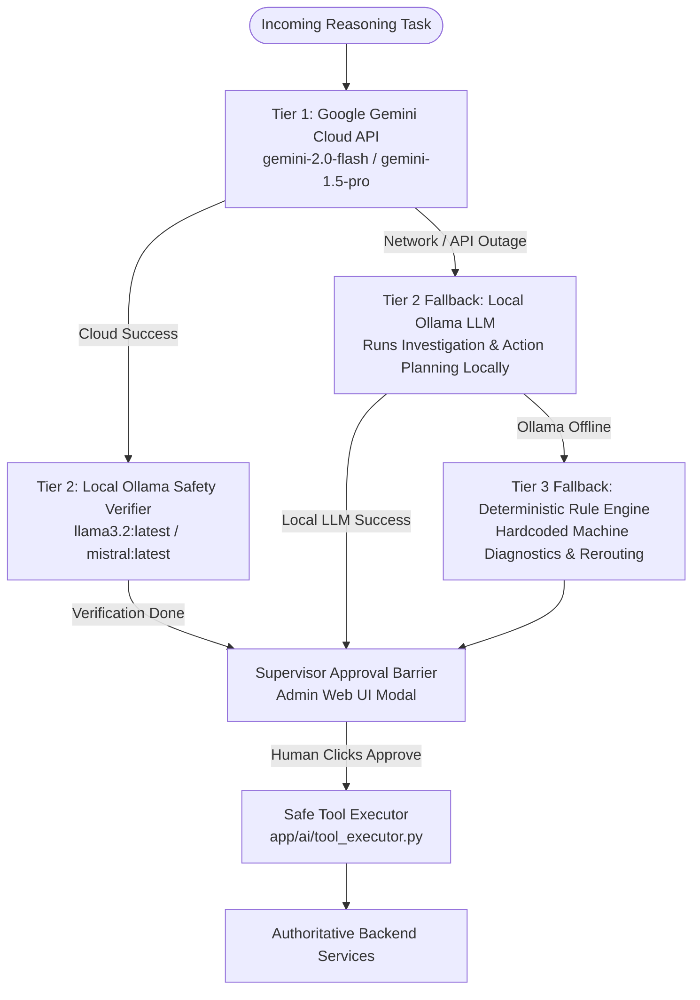
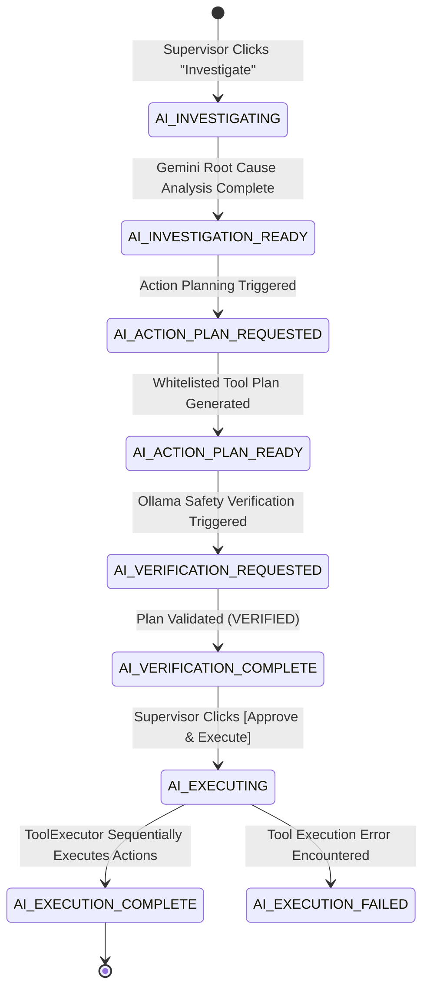

# Subsystem Specification: AI Co-Pilot, Safe Tool Sandbox & Multi-Tier Model Verification
## Document ID: `04_AI_COPILOT_SANDBOX_AND_DUAL_MODELS`

---

# 1. Subsystem Overview & Industrial Safety Vision

In industrial automation and Manufacturing Execution Systems (MES), granting Large Language Models (LLMs) direct access to execute raw database queries, modify machine parameters, or trigger unconstrained API calls is an existential hazard. A single model hallucination could alter metallurgical heat temperatures, drop inventory tables, or dispatch impossible machine cycle speeds.

**Adaptive MES** implements a **Zero-Direct-Access Sandbox Architecture**. 

The AI Co-Pilot operates solely as a high-level cognitive advisor. It ingests sanitized, credential-free telemetry snapshots, identifies root causes, cross-verifies recovery plans using a local secondary LLM, and proposes concrete actions chosen strictly from a whitelist of **12 pre-registered safe tools**. **No state mutation is ever executed on the shop floor without explicit human supervisor approval**.

```
+───────────────────────────────────────────────────────────────────────────────────────────────────+
|                                  THE AI SAFETY SANDBOX ARCHITECTURE                               |
+───────────────────────────────────────────────────────────────────────────────────────────────────+
|                                                                                                   |
|   ❌ UNCONSTRAINED AI (DANGEROUS)                   ✅ ADAPTIVE MES SANDBOX (SAFE & GOVERNED)      |
|   ├── Direct Database Queries (Text-to-Mongo)       ├── Zero Database Access (Sanitized Context)  |
|   ├── Direct Machine Speed Overwrites               ├── 12 Whitelisted Schema-Enforced Tools      |
|   ├── Autonomous Unchecked State Mutations          ├── Independent Secondary LLM Safety Verifier |
|   └── Single Cloud API Point of Failure             └── Mandatory Human Supervisor Approval Barrier|
|                                                                                                   |
+───────────────────────────────────────────────────────────────────────────────────────────────────+
```

---

# 2. Multi-Tier Model Routing & Fallback Hierarchy

To ensure 100% operational uptime in industrial environments (including air-gapped facilities or cloud outages), the system uses a **triple-tier hierarchical model fallback**:



### 1. Tier 1: Primary Engine — Google Gemini (`gemini-2.0-flash`)
* **Role**: Rapid multi-step diagnostic reasoning, failure mode correlation, and tool call parameter extraction.
* **Interface**: Implemented in [`backend/app/ai/gemini_client.py`](file:///c:/nvm/COLLEGE/INTSH/Vocal/backend/app/ai/gemini_client.py).

### 2. Tier 2: Safety Verifier & Offline Fallback — Local Ollama (`llama3.2`)
* **Role A (Safety Verifier)**: When Gemini produces an action plan, Ollama independently cross-examines the plan against plant safety constraints (machine capability compatibility, operator certification, circular lock prevention).
* **Role B (Air-Gapped Fallback)**: If the cloud Gemini API is unreachable, local Ollama seamlessly takes over investigation and planning.
* **Interface**: Implemented in [`backend/app/ai/ollama_verifier.py`](file:///c:/nvm/COLLEGE/INTSH/Vocal/backend/app/ai/ollama_verifier.py) and [`backend/app/ai/ollama_client.py`](file:///c:/nvm/COLLEGE/INTSH/Vocal/backend/app/ai/ollama_client.py).

### 3. Tier 3: Tertiary Fallback — Embedded Deterministic Rule Engine
* **Role**: If both Gemini and Ollama are offline, deterministic pattern matching rules (e.g. `E-VALVE-01` $\to$ pause + maintenance + reroute) generate standard safe recovery plans with zero external dependencies.

---

# 3. The 12 Safe Registered Tools Catalog

All tools callable by Gemini and Ollama are strictly registered in [`backend/app/ai/tool_registry.py`](file:///c:/nvm/COLLEGE/INTSH/Vocal/backend/app/ai/tool_registry.py). The models cannot invoke any function outside this catalog.

```
                                      SAFE TOOL CATALOG INVENTORY
┌─────────────────────────────────┬─────────────┬────────────────────────────────────────────────────────────┐
│ Tool Name                       │ Permission  │ Operational Scope & Underlying Backend Service             │
├─────────────────────────────────┼─────────────┼────────────────────────────────────────────────────────────┤
│ `get_machine_status`            │ `READ_ONLY` │ Inspects live machine state, telemetry, and assignments.   │
│ `get_work_order_execution`      │ `READ_ONLY` │ Retrieves full DAG status, operation progress, and timers. │
│ `get_incident_context`          │ `READ_ONLY` │ Gathers incident snapshots, operator logs, and error codes.│
│ `get_available_resources`       │ `READ_ONLY` │ Queries idle backup workstations matching capabilities.    │
├─────────────────────────────────┼─────────────┼────────────────────────────────────────────────────────────┤
│ `pause_operation`               │ `MUTATION`  │ Pauses an in-progress operation step and releases station. │
│ `resume_operation`              │ `MUTATION`  │ Resumes a paused/blocked operation back to READY.          │
│ `reroute_operation`             │ `MUTATION`  │ Reassigns operation to a compatible idle backup machine.   │
│ `mark_machine_down`             │ `MUTATION`  │ Authoritatively marks broken machine as DOWN in registry.  │
│ `schedule_maintenance`          │ `MUTATION`  │ Schedules repair downtime with auto-recovery timer.        │
│ `resolve_incident`              │ `MUTATION`  │ Closes incident, logs root cause notes, recovers machine.  │
│ `stop_work_order`               │ `MUTATION`  │ Halts entire batch if unrecoverable scrap occurs.          │
│ `create_execution_action_log`   │ `MUTATION`  │ Appends authoritative AI advisory note into event stream.  │
└─────────────────────────────────┴─────────────┴────────────────────────────────────────────────────────────┘
```

---

# 4. Context Sanitization & Prompt Engineering

To guarantee zero data leakage and prevent prompt injection attacks, the system constructs a sanitized JSON context snapshot in `AIContextBuilder`:

```
+───────────────────────────────────────────────────────────────────────────────────────────────────+
|                                    SANITIZED CONTEXT STRUCTURE                                    |
+───────────────────────────────────────────────────────────────────────────────────────────────────+
|                                                                                                   |
|  {                                                                                                |
|    "incident": {                                                                                  |
|      "incidentCode": "INC-1001",                                                                   |
|      "title": "Machine M-01 Hydraulic Pressure Loss",                                             |
|      "severity": "HIGH",                                                                          |
|      "reportedBy": "OP-001 (John Doe)"                                                            |
|    },                                                                                             |
|    "machine": {                                                                                   |
|      "machineCode": "M-01",                                                                       |
|      "status": "DOWN",                                                                            |
|      "capabilities": ["CUTTING"]                                                                  |
|    },                                                                                             |
|    "affectedWorkOrder": {                                                                         |
|      "workOrderCode": "WO-1004",                                                                  |
|      "activeOperation": "OP-10 (Laser Profile Cutting)",                                          |
|      "requiredCapabilities": ["CUTTING"]                                                          |
|    },                                                                                             |
|    "availableBackupResources": [                                                                  |
|      { "machineCode": "M-04", "type": "MULTI_PURPOSE", "capabilities": ["CUTTING", "MILLING"] }   |
|    ]                                                                                              |
|  }                                                                                                |
|                                                                                                   |
+───────────────────────────────────────────────────────────────────────────────────────────────────+
```

---

# 5. AI Operation Lifecycle & Human-in-the-Loop Flow

Every AI engagement is tracked through a 7-stage state machine in `db.ai_operations`:



```
                                  SUPERVISOR APPROVAL MODAL (UI VIEW)
┌────────────────────────────────────────────────────────────────────────────────────────────────────┐
│  🤖 AI Incident Recovery Plan: INC-1001                                                            │
├────────────────────────────────────────────────────────────────────────────────────────────────────┤
│  Root Cause Diagnosis:                                                                             │
│  Proportional hydraulic valve seal failure on Machine M-01. Telemetry confirms 42% pressure drop.  │
│                                                                                                    │
│  🛡️ Ollama Safety Verification:                                                                   │
│  [VERIFIED] Target machine M-04 supports capability 'CUTTING'. No deadlock detected.              │
│                                                                                                    │
│  Proposed Tool Actions:                                                                            │
│  1. `pause_operation` (WO-1004, OP-10)                                                             │
│  2. `reroute_operation` (Target: Machine M-04)                                                     │
│  3. `schedule_maintenance` (Machine M-01, Duration: 45 minutes)                                    │
│                                                                                                    │
│  [ Edit Parameters ]                                              [ APPROVE & EXECUTE PLAN ]       │
└────────────────────────────────────────────────────────────────────────────────────────────────────┘
```

---

# 6. Key Functions & Component Directory

---

## 6.1 Backend Services

### 1. `AIOrchestrator.start_investigation()`
* **File**: [`backend/app/ai/orchestrator.py`](file:///c:/nvm/COLLEGE/INTSH/Vocal/backend/app/ai/orchestrator.py#L37-L143)
* **Functionality**: Builds sanitized context and invokes Gemini to produce `AIInvestigationFinding`.

### 2. `AIOrchestrator.generate_action_plan()`
* **File**: [`backend/app/ai/orchestrator.py`](file:///c:/nvm/COLLEGE/INTSH/Vocal/backend/app/ai/orchestrator.py#L145-L216)
* **Functionality**: Prompts Gemini to select recovery actions strictly from the safe tool registry. Validates every proposed tool call against schema guards.

### 3. `AIOrchestrator.verify_with_ollama()`
* **File**: [`backend/app/ai/orchestrator.py`](file:///c:/nvm/COLLEGE/INTSH/Vocal/backend/app/ai/orchestrator.py#L218-L277)
* **Functionality**: Sends the plan to local Ollama to check equipment capability compatibility and safety rules.

### 4. `AIOrchestrator.approve_and_execute()`
* **File**: [`backend/app/ai/orchestrator.py`](file:///c:/nvm/COLLEGE/INTSH/Vocal/backend/app/ai/orchestrator.py#L279-L370)
* **Functionality**: Enforces admin approval check, then invokes `ToolExecutor` to execute tool calls sequentially against authoritative backend services.

### 5. `ToolExecutor.execute_tool()`
* **File**: [`backend/app/ai/tool_executor.py`](file:///c:/nvm/COLLEGE/INTSH/Vocal/backend/app/ai/tool_executor.py#L21-L350)
* **Functionality**: Bridges tool calls into `MachineService`, `WorkOrderService`, and `IncidentService`.

---

## 6.2 Frontend Components

### 1. `AIInvestigationModal.tsx`
* **File**: [`admin-web/src/components/AIInvestigationModal.tsx`](file:///c:/nvm/COLLEGE/INTSH/Vocal/admin-web/src/components/AIInvestigationModal.tsx)
* **Functionality**: Supervisor modal streaming live Gemini thoughts, tool call proposals, Ollama verification badges, and the interactive `[Approve & Execute]` button.
