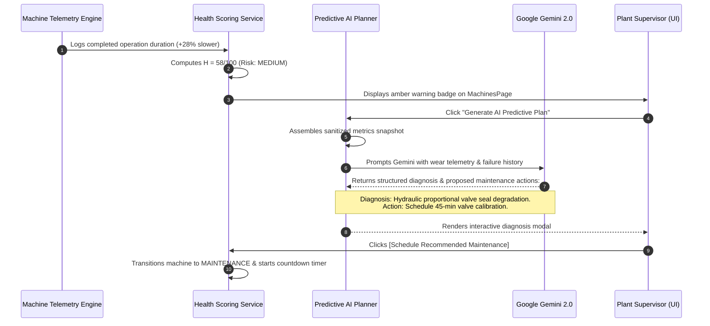

# Subsystem Specification: Statistical Telemetry Analytics & Predictive Health Reasoner
## Document ID: `05_PREDICTIVE_MAINTENANCE_AND_ANALYTICS`

---

# 1. Subsystem Overview & Predictive Philosophy

In high-throughput manufacturing facilities, unplanned machine breakdowns cost thousands of dollars per hour in scrap and delayed shipments. Traditional plants operate under two flawed maintenance models:
1. **Reactive Maintenance ("Run-to-Failure")**: Machines run until catastrophic breakdown, causing emergency work order stoppages.
2. **Static Preventive Maintenance ("Calendar Overhauls")**: Machines are taken offline at arbitrary intervals (e.g. *"every 30 days"*), wasting usable component life and causing unnecessary downtime.

The **Adaptive MES Predictive Maintenance Subsystem** introduces **Continuous Statistical Telemetry & AI Diagnostic Reasoning**. 

By monitoring cycle time degradation, processing rate efficiency, MTBF/MTTR trends, and micro-stoppages across every single operation run, the system dynamically calculates a **Machine Health Score ($0 - 100$)** and uses Google Gemini to generate targeted maintenance proposals before physical failures occur.

```
+───────────────────────────────────────────────────────────────────────────────────────────────────+
|                                CONTINUOUS PREDICTIVE HEALTH PIPELINE                              |
+───────────────────────────────────────────────────────────────────────────────────────────────────+
|                                                                                                   |
|   1. REAL-TIME TELEMETRY INGESTION (Every completed operation logs duration and unit count)       |
|                                │                                                                  |
|                                ▼                                                                  |
|   2. STATISTICAL BASELINE COMPARISON (Calculates cycle time elongation vs baseline rate)          |
|                                │                                                                  |
|                                ▼                                                                  |
|   3. 4-FACTOR PENALTY EVALUATION (Cycle Degradation + Failure Count + Downtime + Operating Age)   |
|                                │                                                                  |
|                                ▼                                                                  |
|   4. DYNAMIC HEALTH SCORE (0 - 100) & RISK CLASSIFICATION (LOW / MEDIUM / HIGH)                   |
|                                │                                                                  |
|                                ▼ (If Health Score < 80)                                           |
|   5. AI CO-PILOT ROOT CAUSE DIAGNOSIS (Gemini correlates wear patterns & proposes maintenance)   |
|                                │                                                                  |
|                                ▼                                                                  |
|   6. ONE-CLICK SCHEDULED MAINTENANCE (Creates repair window & pre-allocates backup routing)        |
|                                                                                                   |
+───────────────────────────────────────────────────────────────────────────────────────────────────+
```

---

# 2. Mathematical Formulations & Penalty Models

---

## 2.1 The Master Health Score Equation ($0 - 100$)
Implemented in [`MachineHealthService.calculate_health_score()`](file:///c:/nvm/COLLEGE/INTSH/Vocal/backend/app/services/machine_health_service.py), machine health is evaluated against a 100-point base using four independent penalty deductions:

$$\text{Health Score } (H) = \max\left(0, \quad 100 - \Big(P_{\text{cycle}} + P_{\text{failure}} + P_{\text{downtime}} + P_{\text{age}}\Big)\right)$$

Where each penalty factor $P_i$ reflects a distinct industrial degradation mode:

```
                                 HEALTH SCORE PENALTY MATRIX
┌───────────────────────────────┬───────────────────────────────────────────────────────────┬───────────────┐
│ Penalty Dimension             │ Mathematical Formulation                                  │ Penalty Range │
├───────────────────────────────┼───────────────────────────────────────────────────────────┼───────────────┤
│ 1. Cycle Time Degradation     │ P_cycle = min(30, max(0, (CycleDeviation% - 10%) * 0.8))  │ 0 to 30 pts   │
│ 2. Recent Breakdown Frequency │ P_failure = min(35, (Failures24h * 15) + (Failures7d * 5))│ 0 to 35 pts   │
│ 3. Excessive Downtime Ratio   │ P_downtime = min(25, (TotalDowntimeSec / TotalSec) * 25)  │ 0 to 25 pts   │
│ 4. Operating Age & Wear       │ P_age = min(10, (OperatingHours / BaselineLife) * 10)     │ 0 to 10 pts   │
└───────────────────────────────┴───────────────────────────────────────────────────────────┴───────────────┘
```

---

## 2.2 Cycle Time Elongation & Speed Degradation
When mechanical components (e.g. ball screws, hydraulic proportional valves, spindle bearings) wear down, machines take progressively longer to complete identical operations.

1. **Theoretical Baseline Cycle Time ($T_{\text{baseline}}$)**:
   $$T_{\text{baseline}} = \frac{1}{\text{Configured Processing Rate (units/sec)}}$$

2. **Recent Measured Cycle Time ($T_{\text{recent}}$)**:
   For the last $k$ completed operations on this machine:
   $$T_{\text{recent}} = \frac{1}{k} \sum_{i=1}^{k} \left( \frac{\text{Operation Duration}_i}{\text{Quantity Processed}_i} \right)$$

3. **Cycle Time Deviation Percentage ($\Delta T\%$)**:
   $$\Delta T\% = \left( \frac{T_{\text{recent}} - T_{\text{baseline}}}{T_{\text{baseline}}} \right) \times 100$$

4. **Processing Rate Efficiency Percentage ($\eta_{\text{rate}}$)**:
   $$\eta_{\text{rate}} = \left( \frac{T_{\text{baseline}}}{T_{\text{recent}}} \right) \times 100$$

---

## 2.3 Reliability Metrics: MTBF & MTTR
The platform continuously updates Mean Time Between Failures and Mean Time to Repair:

$$\text{MTBF} = \frac{\text{Total Operating Seconds}}{\max\left(1, \text{Total Breakdown Incidents}\right)}$$

$$\text{MTTR} = \frac{\text{Total Breakdown Downtime Seconds}}{\max\left(1, \text{Total Breakdown Incidents}\right)}$$

$$\text{Availability Ratio } (A) = \frac{\text{MTBF}}{\text{MTBF} + \text{MTTR}}$$

---

## 2.4 Data Quality & Confidence Ceiling Model
To prevent false-alarm alerts on newly commissioned equipment, the system computes a **Data Quality Tier** and caps the statistical confidence ceiling based on sample size:

```
┌───────────────────────────────┬───────────────────────────┬────────────────────────────────────────┐
│ Sample Size (Operations Run)  │ Data Quality Tier         │ Statistical Confidence Ceiling         │
├───────────────────────────────┼───────────────────────────┼────────────────────────────────────────┤
│ $N < 5$ Operations            │ `INSUFFICIENT`            │ Confidence capped at $\le 60\%$        │
│ $5 \le N \le 15$ Operations   │ `MODERATE`                │ Confidence capped at $\le 80\%$        │
│ $N > 15$ Operations           │ `HIGH`                    │ Full confidence ceiling ($100\%$)      │
└───────────────────────────────┴───────────────────────────┴────────────────────────────────────────┘
```

---

# 3. Risk Classification & Automated Interlocking

```
                                  RISK CLASSIFICATION SPECTRUM
┌───────────────────┬───────────────────┬────────────────────────────────────────────────────────────┐
│ Health Score (H)  │ Risk Level        │ Operational Interlocking & System Action                   │
├───────────────────┼───────────────────┼────────────────────────────────────────────────────────────┤
│ $80 \le H \le 100$│ `LOW` (Green)     │ Standard operation; no intervention required.              │
│ $50 \le H < 80$   │ `MEDIUM` (Amber)  │ Predictive Maintenance Advisory generated; review in 48h.  │
│ $0 \le H < 50$    │ `HIGH` (Red)      │ Urgent Maintenance Required; AI prepares backup failover.  │
└───────────────────┴───────────────────┴────────────────────────────────────────────────────────────┘
```

---

# 4. AI-Assisted Root Cause & Predictive Action Planning

When a machine drops into `MEDIUM` or `HIGH` risk, the system triggers [`AIPredictiveMaintenancePlanner`](file:///c:/nvm/COLLEGE/INTSH/Vocal/backend/app/ai/predictive_maintenance_planner.py).



---

# 5. Key Functions & Component Directory

---

## 5.1 Service Layer

### 1. `MachineHealthService.calculate_health_score()`
* **File**: [`backend/app/services/machine_health_service.py`](file:///c:/nvm/COLLEGE/INTSH/Vocal/backend/app/services/machine_health_service.py#L30-L190)
* **Functionality**: Evaluates historical operation logs, computes MTBF/MTTR, calculates cycle time deviation percentages, and applies the 4-factor penalty formula to yield `MachineHealthAssessment`.

### 2. `MachineHealthService.get_telemetry_metrics()`
* **File**: [`backend/app/services/machine_health_service.py`](file:///c:/nvm/COLLEGE/INTSH/Vocal/backend/app/services/machine_health_service.py#L192-L260)
* **Functionality**: Aggregates total operating seconds, completed operations count, failure counts across 24h/7d/30d windows, and downtime percentages.

### 3. `AIPredictiveMaintenancePlanner.build_sanitized_context()`
* **File**: [`backend/app/ai/predictive_maintenance_planner.py`](file:///c:/nvm/COLLEGE/INTSH/Vocal/backend/app/ai/predictive_maintenance_planner.py#L18-L85)
* **Functionality**: Sanitizes health assessment data into a clean, credential-free JSON prompt payload for LLM analysis.

### 4. `AIPredictiveMaintenancePlanner.generate_predictive_plan()`
* **File**: [`backend/app/ai/predictive_maintenance_planner.py`](file:///c:/nvm/COLLEGE/INTSH/Vocal/backend/app/ai/predictive_maintenance_planner.py#L88-L160)
* **Functionality**: Invokes Google Gemini to generate root cause hypotheses, urgency classifications, estimated downtime requirements, and concrete maintenance action checklists.

---

## 5.2 Frontend Components

### 1. `AIPredictiveMaintenanceModal.tsx`
* **File**: [`admin-web/src/components/AIPredictiveMaintenanceModal.tsx`](file:///c:/nvm/COLLEGE/INTSH/Vocal/admin-web/src/components/AIPredictiveMaintenanceModal.tsx)
* **Functionality**: Interactive predictive maintenance modal. Displays gauge charts for Health Score ($0-100$), cycle time deviation percentage, MTBF/MTTR badges, AI root cause explanations, and a one-click `[Schedule Maintenance]` button.

### 2. `MachinesPage.tsx` (Health Gauges Integration)
* **File**: [`admin-web/src/pages/MachinesPage.tsx`](file:///c:/nvm/COLLEGE/INTSH/Vocal/admin-web/src/pages/MachinesPage.tsx)
* **Functionality**: Displays live circular health score badges on each machine card with color-coded risk indicators.
