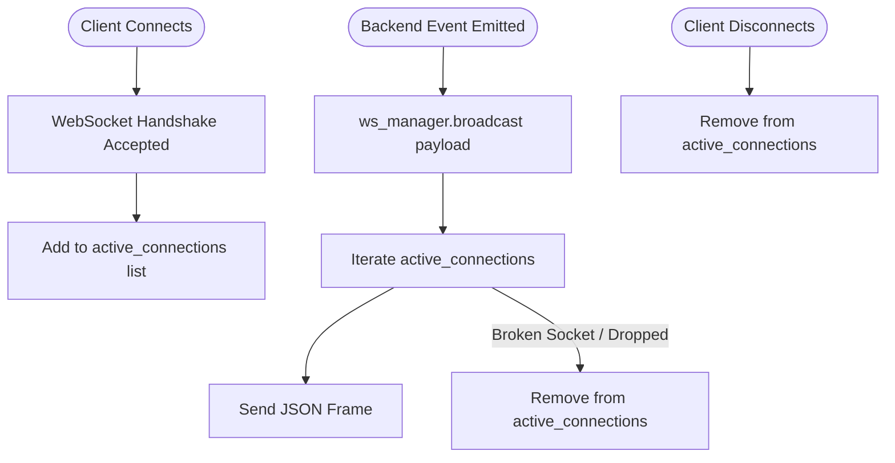

# Subsystem Specification: Distributed Synchronization, Mutex Locking & Real-Time WebSockets
## Document ID: `06_REALTIME_SYNCHRONIZATION_AND_REDIS`

---

# 1. Subsystem Overview & Real-Time Concurrency Challenges

In modern discrete manufacturing execution systems, two high-frequency concurrent execution streams run simultaneously:
1. **Automated Background State Machine Loops**: Continuous 1-second ticks evaluating operation timers, inventory consumption, and machine status.
2. **Concurrent Human & Machine Interventions**: Plant supervisors clicking "Pause", operators submitting "Step Completed", and machines tripping emergency stops via REST APIs.

Without distributed synchronization, these concurrent streams cause catastrophic race conditions: **double-deducted inventory, split-brain machine double-bookings, and visual UI flickering**.

The **Adaptive MES Distributed Synchronization Subsystem** combines **Redis-backed distributed mutex locks** with an **asynchronous WebSocket broadcast bus** to deliver 100% thread-safe execution state synchronization and zero-polling real-time shop floor visibility.

```
+───────────────────────────────────────────────────────────────────────────────────────────────────+
|                                REAL-TIME SYNCHRONIZATION ARCHITECTURE                             |
+───────────────────────────────────────────────────────────────────────────────────────────────────+
|                                                                                                   |
|   ADMIN WEB DASHBOARD (React 18)                  OPERATOR CLIENT (Desktop App)                   |
|   • ReactFlow DAG Canvas (Live In-Place State)    • Active Work Order Screen (Countdown Timer)    |
|   • Shop Floor Digital Twin                       • Emergency Problem Dispatch                    |
|             │                                                  │                                  |
|             │ ws://localhost:8000/api/ws/execution             │ ws://localhost:8000/ws           |
|             ▼                                                  ▼                                  |
|   +───────────────────────────────────────────────────────────────────────────────────────────+   |
|   |                       ConnectionManager (app/core/websocket.py)                           |   |
|   |                 broadcast({ "type": "EVENT_NAME", "data": {...} })                        |   |
|   +───────────────────────────────────────────────────────────────────────────────────────────+   |
|                                                ▲                                                  |
|                                                │ Real-Time Broadcasts                             |
|   +────────────────────────────────────────────┴──────────────────────────────────────────────+   |
|   |                             FASTAPI CORE SERVICES & STATE ENGINE                          |   |
|   +───────────────────────────────────────────────────────────────────────────────────────────+   |
|                                                │                                                  |
|                                                ▼                                                  |
|   +───────────────────────────────────────────────────────────────────────────────────────────+   |
|   |                          REDIS DISTRIBUTED MUTEX LOCKING LAYER                            |   |
|   |   • execution-lock:{work_order_id} (5s TTL) -> Prevents dual-tick state evaluation        |   |
|   |   • execution_engine_lock          (10s TTL) -> Prevents machine double-booking           |   |
|   |   • ping_redis()                   (< 1ms)  -> High-precision system health telemetry     |   |
|   +───────────────────────────────────────────────────────────────────────────────────────────+   |
|                                                                                                   |
+───────────────────────────────────────────────────────────────────────────────────────────────────+
```

---

# 2. Redis Distributed Mutex Locking Mechanics

---

## 2.1 The Atomic Lock Pattern (`SET NX EX`)
To ensure mutual exclusion across multiple asynchronous worker threads and scaled backend instances, locks are acquired using Redis's atomic single-command primitive:

$$\text{Redis Command: } \texttt{SET <lock\_key> "1" NX EX <ttl\_seconds>}$$

* **`NX` (Not Exists)**: Sets the key only if it does not already exist. If another process holds the lock, Redis returns `None` (`False`).
* **`EX <ttl>` (Time-To-Live Expiration)**: Guarantees that if a worker process crashes mid-operation, the lock automatically dissolves after $N$ seconds, preventing permanent system deadlocks.

```python
# Conceptual Implementation in app/services/redis_service.py
async def acquire_lock(lock_key: str, ttl_seconds: int = 10) -> bool:
    client = get_redis()
    # Atomic CAS lock acquisition
    acquired = await client.set(lock_key, "1", nx=True, ex=ttl_seconds)
    return bool(acquired)

async def release_lock(lock_key: str) -> None:
    client = get_redis()
    await client.delete(lock_key)
```

---

## 2.2 Active Distributed Locks in Adaptive MES

### Lock 1: Per-Work-Order Mutex Lock (`execution-lock:{work_order_id}`)
* **File**: [`backend/app/services/execution_engine.py:L204`](file:///c:/nvm/COLLEGE/INTSH/Vocal/backend/app/services/execution_engine.py#L204)
* **TTL**: 5 seconds
* **Protected Operations**:
  1. Advancing operation micro-states (`PENDING` $\to$ `READY` $\to$ `IN_PROGRESS` $\to$ `COMPLETED`).
  2. Decrementing remaining timer seconds.
  3. Deducting raw material inventory upon operation completion.
* **Failure Prevented**: Prevents the 1-second background tick and an operator clicking "Complete Step" from executing parallel state mutations, eliminating double material deductions and duplicate step promotions.

### Lock 2: Plant-Wide Dispatch Lock (`execution_engine_lock`)
* **File**: [`backend/app/services/machine_service.py:L327`](file:///c:/nvm/COLLEGE/INTSH/Vocal/backend/app/services/machine_service.py#L327)
* **TTL**: 10 seconds
* **Protected Operations**:
  1. Quarantining broken machines (`status = DOWN`).
  2. Pausing affected in-flight batches.
  3. Querying idle backup machines and reserving alternative workstations.
* **Failure Prevented**: Prevents split-brain machine allocation where two different work orders claim the same backup workstation simultaneously during an emergency.

---

# 3. Bi-Directional WebSocket Architecture

---

## 3.1 Connection Manager & Socket Lifecycle
The WebSocket subsystem is managed globally by `ConnectionManager` in [`backend/app/core/websocket.py`](file:///c:/nvm/COLLEGE/INTSH/Vocal/backend/app/core/websocket.py):



### Key Capabilities:
* **Concurreny & Pruning**: Broadcasts events concurrently using `asyncio.gather()`. If a client drops connection abruptly, the socket is pruned safely without throwing uncaught exceptions.
* **Compatibility Aliases**: Exposes `/api/ws/execution`, `/api/ws`, `/ws/execution`, and `/ws` to support both modern browsers and legacy desktop clients.

---

## 3.2 Master WebSocket Event Catalog

Every event pushed through the WebSocket bus follows the standard envelope: `{ "type": "<EVENT_TYPE>", "data": { ... } }`.

```
                                  MASTER WEBSOCKET EVENT DIRECTORY
┌───────────────────────────────┬───────────────────────────────┬────────────────────────────────────────────────────────────┐
│ Event Type (`type`)           │ Emitting Backend Service      │ UI Consumption & Reactive Screen Behavior                  │
├───────────────────────────────┼───────────────────────────────┼────────────────────────────────────────────────────────────┤
│ `EXECUTION_STATE_UPDATE`      │ `ExecutionEngine`             │ Updates ReactFlow node timers, progress bars, and badges.  │
│ `EXECUTION_EVENT`             │ `ExecutionEngine`             │ Appends chronological log to the audit stream drawer.      │
│ `WORK_ORDER_STARTED`          │ `WorkOrderService`            │ Transitions work order card to IN_PROGRESS on grid.        │
│ `WORK_ORDER_COMPLETED`        │ `WorkOrderService`            │ Triggers completion checkmark and unlocks final parts.     │
│ `MACHINE_FAILED`              │ `MachineService`              │ Turns machine card RED (DOWN) and flags blocked nodes.     │
│ `MACHINE_RECOVERED`           │ `MachineService`              │ Restores machine card to GREEN (IDLE) and enables dispatch.│
│ `MACHINE_MAINTENANCE_SCHEDULED│ `MachineService`              │ Sets machine to AMBER and starts repair countdown.         │
│ `INCIDENT_CREATED`            │ `IncidentService`             │ Increments sidebar incident badge counter and shows toast. │
│ `INCIDENT_RESOLVED`           │ `IncidentService`             │ Decrements incident counter and archives incident item.    │
│ `MATERIAL_RESERVED`           │ `MaterialReservationService`  │ Updates Work Order BOM modal with allocated lot numbers.   │
│ `MATERIAL_CONSUMED`           │ `MaterialReservationService`  │ Permanently updates warehouse inventory stock tables.      │
│ `ACTIVATION_REQUESTED`        │ `OperatorActivationService`   │ Displays pending terminal pairing request on UsersPage.    │
│ `ACTIVATION_APPROVED`         │ `OperatorActivationService`   │ Instantly unlocks desktop terminal screen for operator.    │
│ `AI_OPERATION_UPDATED`        │ `AIOrchestrator`              │ Streams live Gemini reasoning, tool calls, and plan steps. │
└───────────────────────────────┴───────────────────────────────┴────────────────────────────────────────────────────────────┘
```

---

# 4. Frontend Reactive UI Architecture (Zero Polling)

Traditional web applications query the server on repetitive intervals (e.g. `setInterval(fetch, 2000)`), causing high server CPU load and laggy interfaces. 

Adaptive MES implements **In-Place Reactive Canvas Synchronization**:

```
                                IN-PLACE REACTFLOW CANVAS SYNC
                                
  Incoming WebSocket Message: EXECUTION_STATE_UPDATE
  │
  ├── 1. Extracts: operations array for active Work Order
  │
  ├── 2. Updates Node Status Map in Memory:
  │      nodeStateMap.set("OP-10", { status: "IN_PROGRESS", remainingSec: 42 })
  │
  └── 3. Mutates Custom Node Components in ReactFlow:
         • Updates inner countdown timer (42s -> 41s)
         • Updates SVG progress circle fill percentage
         • Updates border styling (Pulsing Indigo)
         • ZERO canvas re-layout or node repositioning!
```

### React StrictMode Unmount Safety
In modern React (v18+), components in development mode mount, unmount, and re-mount rapidly to detect side effects. Adaptive MES implements **deferred cleanup guards**:

```typescript
// Standardized WebSocket Lifecycle Guard in Admin Web
useEffect(() => {
  const ws = new WebSocket(`${WS_URL}/api/ws/execution`);
  
  ws.onmessage = (event) => {
    const msg = JSON.parse(event.data);
    handleRealtimeUpdate(msg);
  };

  return () => {
    // If socket is still connecting, defer close until onopen to prevent browser errors
    if (ws.readyState === WebSocket.CONNECTING) {
      ws.onopen = () => ws.close();
    } else {
      ws.close();
    }
  };
}, []);
```

---

# 5. Key Functions & Component Directory

---

## 5.1 Backend Services

### 1. `RedisService.acquire_lock()` & `release_lock()`
* **File**: [`backend/app/services/redis_service.py`](file:///c:/nvm/COLLEGE/INTSH/Vocal/backend/app/services/redis_service.py#L12-L35)
* **Functionality**: Manages atomic distributed locks with automatic TTL expiration.

### 2. `RedisManager.ping_redis()`
* **File**: [`backend/app/core/redis.py`](file:///c:/nvm/COLLEGE/INTSH/Vocal/backend/app/core/redis.py#L42-L58)
* **Functionality**: Probes Redis with microsecond-precision timestamps to calculate roundtrip latency for `/api/health`.

### 3. `ConnectionManager.broadcast()`
* **File**: [`backend/app/core/websocket.py`](file:///c:/nvm/COLLEGE/INTSH/Vocal/backend/app/core/websocket.py#L22-L48)
* **Functionality**: Concurrently sends JSON frames to all connected client sockets and automatically removes dead connections.

---

## 5.2 Frontend Components

### 1. `WorkflowDesignerPage.tsx`
* **File**: [`admin-web/src/pages/WorkflowDesignerPage.tsx`](file:///c:/nvm/COLLEGE/INTSH/Vocal/admin-web/src/pages/WorkflowDesignerPage.tsx)
* **Functionality**: Subscribes to `EXECUTION_STATE_UPDATE` to update node timers and progress bars in-place.

### 2. `Dashboard.tsx`
* **File**: [`admin-web/src/components/Dashboard.tsx`](file:///c:/nvm/COLLEGE/INTSH/Vocal/admin-web/src/components/Dashboard.tsx)
* **Functionality**: Subscribes to machine state and incident events to refresh plant OEE and workstation digital twin cards live.
