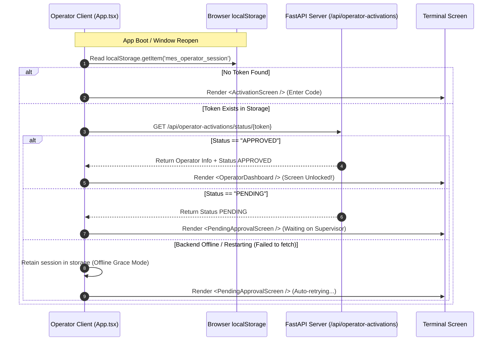
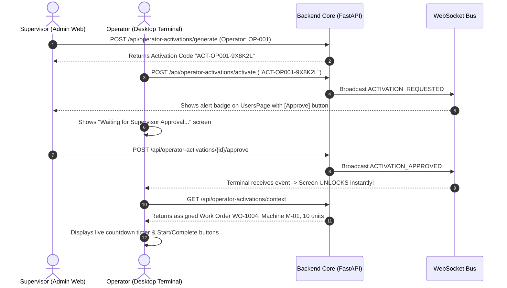

# Subsystem Specification: Desktop Operator Client, QR Pairing & Station Security
## Document ID: `07_OPERATOR_CLIENT_AND_STATION_SECURITY`

---

# 1. Subsystem Overview & Station Locking Paradigm

On a physical factory floor, operators interact with ruggedized touchscreen terminals mounted directly onto heavy CNC machinery, press brakes, and robotic welding cells. 

Allowing unauthenticated access or requiring complex password logins on dusty shop-floor screens creates severe safety and security risks. If an uncertified operator runs an operation, machine damage or human injury can occur.

The **Adaptive MES Operator Client Subsystem** introduces a **Zero-Trust Station Locking & QR Pairing Model**:
1. **Station Lock**: Terminal screens remain locked in an unactivated state until explicitly paired.
2. **One-Time QR / Activation Codes**: Supervisors generate time-bounded pairing codes in the Admin Web.
3. **Cryptographic Session Tokens**: Terminals receive 32-byte cryptographic tokens (`sess_...`) stored securely in persistent storage.
4. **Supervisor Approval Barrier**: Even with a valid code, the terminal cannot access production workflows until a supervisor approves the session.
5. **Focused Shop-Floor Experience**: Operators see only their assigned machine, live countdown timer, and emergency incident dispatch buttons.

```
+───────────────────────────────────────────────────────────────────────────────────────────────────+
|                                OPERATOR TERMINAL LIFECYCLE FLOW                                   |
+───────────────────────────────────────────────────────────────────────────────────────────────────+
|                                                                                                   |
|  1. ADMIN WEB (Supervisor)         2. OPERATOR TERMINAL               3. APPROVAL & UNLOCK        |
|  Generates Activation Code ──► Enters Code (ACT-OP001-X9K2) ──► Supervisor Approves Terminal      |
|  (e.g., ACT-OP001-X9K2L1)          Generates session_token              Pushes ACTIVATION_APPROVED|
|                                    Stored in localStorage               Terminal screen UNLOCKS!  |
|                                                                                                   |
|  4. LIVE OPERATION VIEW            5. INCIDENT DISPATCH               6. PERSISTENT REBOOT        |
|  Live countdown (42s remaining)    1-Click Emergency Stop & Alert     Terminal reboots cleanly    |
|  Input Quantity & Machine Code     Auto-generates Incident in Admin   without re-login required   |
|                                                                                                   |
+───────────────────────────────────────────────────────────────────────────────────────────────────+
```

---

# 2. Terminal Security & Authentication Protocol

---

## 2.1 Cryptographic Token Generation
When an operator submits an activation code, the backend generates a cryptographically secure, high-entropy 32-byte URL-safe token in [`OperatorActivationService.submit_activation()`](file:///c:/nvm/COLLEGE/INTSH/Vocal/backend/app/services/operator_activation_service.py#L99-L140):

$$\text{SessionToken} = \text{"sess\_"} \;+\; \text{secrets.token\_urlsafe}(32)$$

This token is stored in `db.operator_activations` alongside client telemetry (User-Agent, OS platform, timestamp).

---

## 2.2 Custom Header Authentication (`X-Operator-Session`)
Every subsequent operational request from the terminal is authenticated using a custom HTTP header:

$$\texttt{X-Operator-Session: sess\_4f89d9e034ac7b12...}$$

In [`OperatorActivationService.get_operator_context()`](file:///c:/nvm/COLLEGE/INTSH/Vocal/backend/app/services/operator_activation_service.py#L303-L335), the backend verifies:
1. Does the session token exist in `db.operator_activations`?
2. Is the status strictly equal to `APPROVED`?
3. Resolves the operator's employee profile, assigned machine, and active work order operation.

---

# 3. Session Persistence & Offline Reboot Resilience

Factory terminals often experience sudden power cycling or network drops. The client architecture guarantees that **operators do not have to re-enter activation codes every time a terminal restarts**.



### Explicit Logout Flow:
Only when the operator clicks `[Logout]` in the dashboard header are all keys wiped:
```typescript
// operator-client/src/App.tsx
const handleResetSession = () => {
  localStorage.removeItem('mes_operator_session');
  localStorage.removeItem('mes_operator_emp_id');
  localStorage.removeItem('mes_operator_name');
  setSessionToken(null);
  setApprovalStatus(null);
};
```

---

# 4. End-to-End Pairing & Operation Sequence



---

# 5. Shop-Floor Operational Features

---

## 5.1 Active Operation View & Live Countdown
* **Real-Time Synchronized Timer**: Displays remaining cycle time computed from machine processing rate.
* **Batch Details**: Displays Work Order business code (e.g. `WO-1004`), part description, sequence number, and target quantity.
* **One-Click Step Completion**: Allows operator to confirm batch completion, triggering automated inventory deduction and DAG progression.

---

## 5.2 Emergency Incident & Problem Dispatch
When a machine jam, tooling defect, or raw material anomaly occurs, the operator clicks **`[Report Problem]`**:

```
                                  REPORT PROBLEM MODAL (UI VIEW)
┌────────────────────────────────────────────────────────────────────────────────────────────────────┐
│  ⚠️ Report Shop-Floor Problem / Anomaly                                                           │
├────────────────────────────────────────────────────────────────────────────────────────────────────┤
│  Workstation: Machine M-01 (Fiber Laser Cutter)                                                    │
│  Active Work Order: WO-1004 (Rush Batch Brackets)                                                  │
│                                                                                                    │
│  Problem Description:                                                                              │
│  [ Laser beam focus lost; hydraulic assist pressure dropped below 4.2 bar. ]                       │
│                                                                                                    │
│  [ Cancel ]                                                        [ DISPATCH EMERGENCY ALERT ]    │
└────────────────────────────────────────────────────────────────────────────────────────────────────┘
```

* **Instant Backend Interlock**: Submitting the problem automatically calls `OperatorActivationService.report_problem()`, creating an incident in `db.incidents`, tagging the machine, and alerting the plant supervisor.

---

## 5.3 My Reports History Drawer
Accessible via the sidebar icon, this drawer provides operators with a full historical record of all incidents and maintenance requests submitted from their specific terminal.

---

# 6. Key Functions & Component Directory

---

## 6.1 Backend Services

### 1. `OperatorActivationService.generate_activation_code()`
* **File**: [`backend/app/services/operator_activation_service.py`](file:///c:/nvm/COLLEGE/INTSH/Vocal/backend/app/services/operator_activation_service.py#L42-L97)
* **Functionality**: Generates unique time-stamped codes (`ACT-OP001-XXXXXX`) and revokes any prior unapproved codes.

### 2. `OperatorActivationService.submit_activation()`
* **File**: [`backend/app/services/operator_activation_service.py`](file:///c:/nvm/COLLEGE/INTSH/Vocal/backend/app/services/operator_activation_service.py#L99-L140)
* **Functionality**: Validates code, generates 32-byte session token, and sets status to `PENDING`.

### 3. `OperatorActivationService.approve_activation()`
* **File**: [`backend/app/services/operator_activation_service.py`](file:///c:/nvm/COLLEGE/INTSH/Vocal/backend/app/services/operator_activation_service.py#L170-L217)
* **Functionality**: Transitions activation to `APPROVED` and broadcasts `ACTIVATION_APPROVED` to unlock the terminal screen.

### 4. `OperatorActivationService.get_operator_context()`
* **File**: [`backend/app/services/operator_activation_service.py`](file:///c:/nvm/COLLEGE/INTSH/Vocal/backend/app/services/operator_activation_service.py#L303-L360)
* **Functionality**: Authenticates `X-Operator-Session` header and returns live machine and work order assignments.

---

## 6.2 Frontend Components (Operator Client)

### 1. `App.tsx`
* **File**: [`operator-client/src/App.tsx`](file:///c:/nvm/COLLEGE/INTSH/Vocal/operator-client/src/App.tsx)
* **Functionality**: Root application router managing `localStorage` session bootstrap, backend verification, and screen state switching (`ActivationScreen` $\to$ `PendingApprovalScreen` $\to$ `OperatorDashboard`).

### 2. `OperatorDashboard.tsx`
* **File**: [`operator-client/src/components/OperatorDashboard.tsx`](file:///c:/nvm/COLLEGE/INTSH/Vocal/operator-client/src/components/OperatorDashboard.tsx)
* **Functionality**: Main operator interface displaying active work order countdown timers, machine locks, and problem reporting controls.

### 3. `ReportProblemModal.tsx` & `MyReportsDrawer.tsx`
* **File**: [`operator-client/src/components/ReportProblemModal.tsx`](file:///c:/nvm/COLLEGE/INTSH/Vocal/operator-client/src/components/ReportProblemModal.tsx)
* **Functionality**: Modal and drawer for submitting emergency shop-floor alerts and viewing historical reports.
