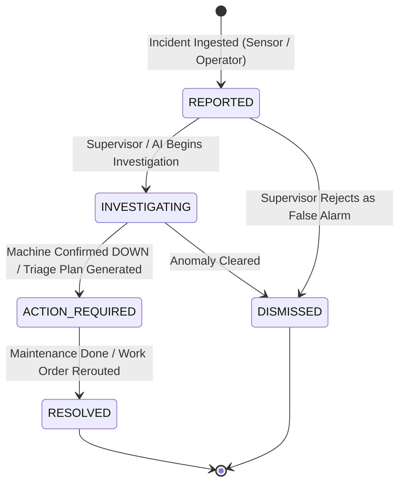
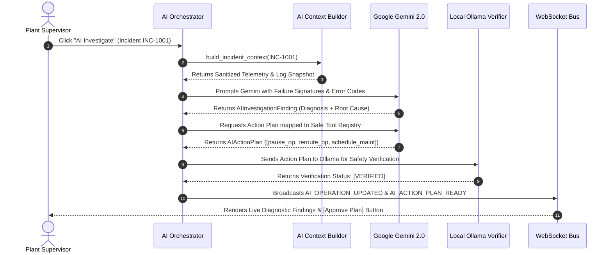

# Subsystem Specification: Plant-Wide Incident Triage, AI Root Cause Analysis (RCA) & Audit Trail
## Document ID: `08_INCIDENT_TRIAGE_AND_RCA_PIPELINE`

---

# 1. Subsystem Overview & Triage Philosophy

In modern discrete manufacturing, unexpected shop-floor incidents (hydraulic pressure drops, CNC spindle tool breakages, laser optic fouling, raw material tensile failures) occur continuously. When an incident occurs, traditional factories suffer from delayed communication: operators walk to the supervisor's office, paper incident sheets are filled out, and machines sit idle for hours before investigation begins.

The **Adaptive MES Incident Triage & RCA Subsystem** provides a **unified digital incident response pipeline**:
1. **Multi-Source Incident Ingestion**: Anomalies reported via machine sensor telemetry, desktop operator terminals, or supervisor manual logs.
2. **Automated Safety Interlocking**: Automatic machine status quarantine (`DOWN`) and affected batch pausing.
3. **AI-Assisted Root Cause Analysis (RCA)**: Google Gemini analyzes error signatures, sensor histories, and operator descriptions to diagnose root causes.
4. **Structured Recovery Execution**: Whitelisted recovery actions (rerouting, emergency maintenance, component calibration) executed with one click.
5. **Append-Only Immutable Audit Trail**: Complete, tamper-proof history of every action, actor, timestamp, and state transition in `db.audit_events`.

```
+───────────────────────────────────────────────────────────────────────────────────────────────────+
|                                    INCIDENT RESPONSE PIPELINE                                     |
+───────────────────────────────────────────────────────────────────────────────────────────────────+
|                                                                                                   |
|  1. INGESTION               2. INTERLOCK & TRIAGE       3. AI INVESTIGATION      4. RECOVERY      |
|  • Sensor Anomaly     ──►   • Machine marked DOWN  ──►  • Gemini RCA Analysis ──►• 1-Click Reroute|
|  • Operator Dispatch        • Active Batch PAUSED       • Ollama Verification    • Auto-Maintenance|
|  • Supervisor Alert         • Incident Code Assigned    • Recovery Plan Drafted  • Machine IDLE   |
|                                                                                                   |
+───────────────────────────────────────────────────────────────────────────────────────────────────+
```

---

# 2. Incident State Machine & Severity Classification

---

## 2.1 Incident State Machine Lifecycle
Every incident registered in `db.incidents` progresses through a strict 5-stage state machine:



```
                                  INCIDENT LIFECYCLE SPECIFICATION
┌───────────────────┬───────────────────┬────────────────────────────────────────────────────────────┐
│ Incident Status   │ Badge UI Color    │ Operational Meaning & System Action                        │
├───────────────────┼───────────────────┼────────────────────────────────────────────────────────────┤
│ `REPORTED`        │ Amber (Yellow)    │ Initial anomaly flagged; awaiting supervisor review.       │
│ `INVESTIGATING`   │ Blue (Sky)        │ Telemetry being examined; AI RCA investigation in progress.│
│ `ACTION_REQUIRED` │ Red (Rose)        │ Machine confirmed DOWN; shop-floor failover required.     │
│ `RESOLVED`        │ Green (Emerald)   │ Repairs complete, root cause documented, machine restored. │
│ `DISMISSED`       │ Gray (Zinc)       │ False alarm or minor sensor glitch; archived without lock. │
└───────────────────┴───────────────────┴────────────────────────────────────────────────────────────┘
```

---

## 2.2 Severity Classification Matrix
Incidents are assigned standard severity ratings that govern routing priority and alerting speed:

$$\text{Severity Level} \in \{\text{CRITICAL}, \text{HIGH}, \text{MEDIUM}, \text{LOW}\}$$

```
┌───────────────────┬───────────────────────────────────────────────────────────┬────────────────────────┐
│ Severity Rating   │ Qualifying Industrial Conditions                          │ Automated Action       │
├───────────────────┼───────────────────────────────────────────────────────────┼────────────────────────┤
│ `CRITICAL`        │ Fire, emergency safety stop trip, uncontained chemical.   │ Immediate Plant Halt   │
│ `HIGH`            │ Complete spindle lock, hydraulic loss, machine DOWN.       │ Batch Auto-Pause       │
│ `MEDIUM`          │ Tooling wear, progressive cycle elongation, minor sensor.  │ Predictive Advisory    │
│ `LOW`             │ Cosmetic flaw, minor packaging tear, routine alert.       │ Logged for Shift End   │
└───────────────────┴───────────────────────────────────────────────────────────┴────────────────────────┘
```

---

# 3. AI Root Cause Analysis (RCA) Pipeline

When an incident is escalated for AI investigation, `AIOrchestrator` executes a 4-phase root cause discovery sequence:



---

# 4. Immutable Audit Event Logging (`db.audit_events`)

To satisfy international manufacturing compliance standards (ISO 9001, FDA 21 CFR Part 11, IATF 16949), every state change across the factory generates a **non-repudiable, append-only audit record**.

```
+───────────────────────────────────────────────────────────────────────────────────────────────────+
|                                    AUDIT EVENT DATA STRUCTURE                                     |
+───────────────────────────────────────────────────────────────────────────────────────────────────+
|                                                                                                   |
|  {                                                                                                |
|    "_id": ObjectId("6a8930b1..."),                                                                |
|    "timestamp": ISODate("2026-08-22T14:15:00.104Z"),                                             |
|    "actorId": "USER-SUPERVISOR-01",                                                               |
|    "actorType": "ADMIN",             // ADMIN | OPERATOR | SYSTEM | AI                            |
|    "action": "INCIDENT_RESOLVED",                                                                 |
|    "entityType": "incident",         // incident | machine | work_order | material                |
|    "entityId": "6a892eb8...",                                                                     |
|    "source": "AI_ORCHESTRATOR",      // ADMIN | OPERATOR_CLIENT | AI_ORCHESTRATOR | SYSTEM        |
|    "metadata": {                                                                                  |
|      "incidentCode": "INC-1001",                                                                   |
|      "resolution": "Proportional hydraulic valve seal replaced. Pressure calibrated to 6.2 bar.",  |
|      "downtimeDurationMinutes": 45                                                                |
|    },                                                                                             |
|    "createdAt": ISODate("2026-08-22T14:15:00.104Z")                                               |
|  }                                                                                                |
|                                                                                                   |
+───────────────────────────────────────────────────────────────────────────────────────────────────+
```

---

# 5. Key Functions & Component Directory

---

## 5.1 Service Layer

### 1. `IncidentService.create_incident()`
* **File**: [`backend/app/services/incident_service.py`](file:///c:/nvm/COLLEGE/INTSH/Vocal/backend/app/services/incident_service.py#L90-L150)
* **Functionality**: Generates monotonic unique codes (`INC-0001`), sets severity, links active work orders and machines, and logs `INCIDENT_CREATED`.

### 2. `IncidentService.confirm_incident()`
* **File**: [`backend/app/services/incident_service.py`](file:///c:/nvm/COLLEGE/INTSH/Vocal/backend/app/services/incident_service.py#L180-L225)
* **Functionality**: Confirms machine breakdown, triggers `MachineService.fail_machine()`, pauses running operations, and sets status to `ACTION_REQUIRED`.

### 3. `IncidentService.resolve_incident()`
* **File**: [`backend/app/services/incident_service.py`](file:///c:/nvm/COLLEGE/INTSH/Vocal/backend/app/services/incident_service.py#L300-L360)
* **Functionality**: Records root cause resolution notes, recovers associated `DOWN` machine back to `IDLE`, and updates incident status to `RESOLVED`.

### 4. `IncidentService.dismiss_incident()`
* **File**: [`backend/app/services/incident_service.py`](file:///c:/nvm/COLLEGE/INTSH/Vocal/backend/app/services/incident_service.py#L365-L400)
* **Functionality**: Archives false-alarm incidents without altering equipment states.

### 5. `AuditService.log_event()`
* **File**: [`backend/app/services/audit_service.py`](file:///c:/nvm/COLLEGE/INTSH/Vocal/backend/app/services/audit_service.py#L6-L38)
* **Functionality**: Non-blocking asynchronous insertion into `db.audit_events`.

---

## 5.2 Frontend Components

### 1. `IncidentsPage.tsx`
* **File**: [`admin-web/src/pages/IncidentsPage.tsx`](file:///c:/nvm/COLLEGE/INTSH/Vocal/admin-web/src/pages/IncidentsPage.tsx)
* **Functionality**: Plant incident feed. Displays active breakdowns, severity badges, linked machine/batch cards, and one-click `[Investigate with AI]` triggers.

### 2. `AuditLogsPage.tsx`
* **File**: [`admin-web/src/pages/AuditLogsPage.tsx`](file:///c:/nvm/COLLEGE/INTSH/Vocal/admin-web/src/pages/AuditLogsPage.tsx)
* **Functionality**: Interactive compliance log viewer with full-text search, entity filters (`work_order`, `machine`, `user`), and JSON metadata inspectors.
