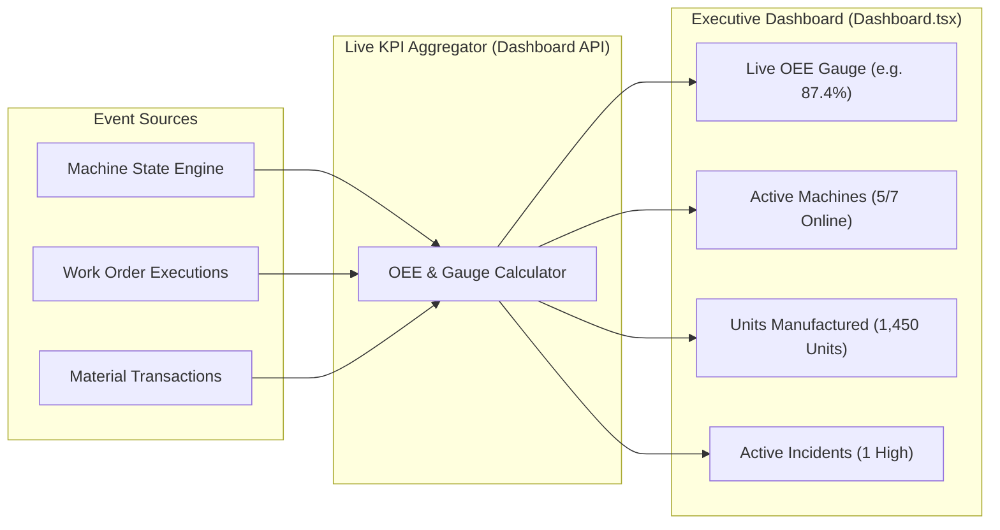

# Subsystem Specification: Overall Equipment Effectiveness (OEE) & Factory KPI Analytics
## Document ID: `09_OEE_AND_FACTORY_KPI_ANALYTICS`

---

# 1. Subsystem Overview & Operational KPI Philosophy

In modern manufacturing leadership, real-time decision-making requires transforming fragmented operational events into consolidated, actionable business intelligence. Plant managers cannot wait for end-of-month spreadsheets to identify line bottlenecks, excessive scrap rates, or failing workstation throughput.

The **Adaptive MES Factory KPI & OEE Analytics Subsystem** aggregates live machine telemetry, material transaction ledgers, and work order completion timestamps into **real-time quantitative factory health metrics**.

```
+───────────────────────────────────────────────────────────────────────────────────────────────────+
|                                    FACTORY KPI ANALYTICS ENGINE                                   |
+───────────────────────────────────────────────────────────────────────────────────────────────────+
|                                                                                                   |
|  1. LIVE DATA STREAMS               2. STATISTICAL AGGREGATION       3. EXECUTIVE DASHBOARD       |
|  • Machine Run/Downtime Timers ──►  • Availability Ratio (A)    ──►  • Plant-Wide OEE Gauge (86%) |
|  • Output vs Scrapped Units         • Speed Efficiency (P)           • Active Machine Counts      |
|  • Work Order Due Dates             • Quality Yield Rate (Q)         • Real-Time Units Produced   |
|                                                                                                   |
+───────────────────────────────────────────────────────────────────────────────────────────────────+
```

---

# 2. Overall Equipment Effectiveness (OEE) Mathematical Framework

The international benchmark for measuring manufacturing productivity is **Overall Equipment Effectiveness (OEE)**:

$$\text{OEE} = \text{Availability } (A) \times \text{Performance } (P) \times \text{Quality } (Q)$$

---

## 2.1 Availability ($A$) — Downtime Loss
Availability measures the proportion of planned production time that workstations are physically operational, accounting for breakdowns, setups, and material shortages:

$$A = \frac{\text{Operating Time}}{\text{Planned Production Time}} = \frac{\text{Planned Time} - \text{Total Downtime}}{\text{Planned Time}}$$

Where:
* $\text{Planned Time}$: Total shift hours allocated for manufacturing.
* $\text{Total Downtime}$: Sum of all machine breakdown hours (`status = DOWN`) and maintenance periods (`status = MAINTENANCE`).

---

## 2.2 Performance ($P$) — Speed & Minor Stoppage Loss
Performance measures the operating speed of the equipment compared to its rated maximum engineering capability:

$$P = \frac{\text{Ideal Cycle Time} \times \text{Total Units Produced}}{\text{Operating Time}}$$

$$P = \frac{\left(\frac{1}{\text{Configured Processing Rate}}\right) \times \text{Total Output}}{\text{Operating Time}}$$

Where:
* $P = 1.0 \; (100\%)$: The machine operated at 100% of its rated nameplate speed.
* $P < 1.0$: Speed losses occurred due to mechanical wear, feed hesitation, or minor operator delays.

---

## 2.3 Quality ($Q$) — Defect & Yield Loss
Quality measures the proportion of manufactured units that meet quality tolerances without being scrapped:

$$Q = \frac{\text{Good Units Produced}}{\text{Total Units Produced}} = \frac{\text{Total Output} - \text{Scrapped Units}}{\text{Total Output}}$$

Where:
* $\text{Scrapped Units}$: Cumulative units logged in `db.material_transactions` with `transaction_type = SCRAP`.

---

## 2.4 World-Class OEE Benchmark Comparison
The platform compares plant metrics against standard world-class discrete manufacturing benchmarks:

```
┌───────────────────────────────┬───────────────────────────┬────────────────────────────────────────┐
│ OEE Dimension                 │ World-Class Benchmark     │ Factory Floor Performance Tier         │
├───────────────────────────────┼───────────────────────────┼────────────────────────────────────────┤
│ Availability ($A$)            │ $\ge 90.0\%$              │ World-Class Availability               │
│ Performance ($P$)             │ $\ge 95.0\%$              │ Optimal Throughput Speed               │
│ Quality ($Q$)                 │ $\ge 99.9\%$              │ Six-Sigma Yield Rate                   │
│ **Overall OEE ($A \times P \times Q$)** │ **$\ge 85.0\%$**  │ **World-Class Manufacturing Level**    │
└───────────────────────────────┴───────────────────────────┴────────────────────────────────────────┘
```

---

# 3. Core Plant Operational KPIs

In addition to OEE, Adaptive MES computes continuous operational metrics:

---

## 3.1 Workstation Utilization Rate
Measures how effectively capital equipment is utilized across the factory:

$$\text{Utilization} = \left( \frac{\sum_{i=1}^{M} \text{Operating Hours}(M_i)}{\sum_{i=1}^{M} \text{Total Shift Hours}(M_i)} \right) \times 100$$

---

## 3.2 On-Time Delivery (OTD) Ratio
Tracks adherence to customer production schedules:

$$\text{OTD} = \left( \frac{\text{Count of Work Orders Completed on or Before DueDate}}{\text{Total Count of Completed Work Orders}} \right) \times 100$$

---

## 3.3 Scrap Rate Percentage
Quantifies raw material waste across all active production batches:

$$\text{Scrap Rate } (\%) = \left( \frac{\text{Total Scrapped Material Quantity}}{\text{Total Raw Material Quantity Consumed}} \right) \times 100$$

---

# 4. Real-Time Telemetry Streaming & UI Visualization



```
                                  EXECUTIVE DASHBOARD (UI SPECIFICATION)
┌────────────────────────────────────────────────────────────────────────────────────────────────────┐
│  🏭 Adaptive MES — Plant Executive Overview                                                        │
├───────────────────┬───────────────────┬───────────────────┬───────────────────┬────────────────────┤
│  PLANT OEE        │ TOTAL UNITS       │ ACTIVE MACHINES   │ SCRAP RATE        │ ACTIVE INCIDENTS   │
│  86.4%            │ 1,450 Units       │ 5 / 7 Online      │ 0.8%              │ 1 Action Required  │
│  (A: 92% P: 95% Q: 99%) (+120 Today)  │ (1 Down, 1 Maint) │ (Within Target)   │ (INC-1001: M-01)   │
└───────────────────┴───────────────────┴───────────────────┴───────────────────┴────────────────────┘
```

---

# 5. Key Functions & Component Directory

---

## 5.1 Presentation Components

### 1. `Dashboard.tsx`
* **File**: [`admin-web/src/components/Dashboard.tsx`](file:///c:/nvm/COLLEGE/INTSH/Vocal/admin-web/src/components/Dashboard.tsx)
* **Functionality**: Main executive dashboard. Computes and renders live OEE gauges, active workstation status cards, units manufactured counters, and links to active incident triage modals.

### 2. `WorkOrdersPage.tsx`
* **File**: [`admin-web/src/pages/WorkOrdersPage.tsx`](file:///c:/nvm/COLLEGE/INTSH/Vocal/admin-web/src/pages/WorkOrdersPage.tsx)
* **Functionality**: Batch performance metrics, showing on-time completion badges and actual vs estimated execution time comparisons.

### 3. `AuditLogsPage.tsx`
* **File**: [`admin-web/src/pages/AuditLogsPage.tsx`](file:///c:/nvm/COLLEGE/INTSH/Vocal/admin-web/src/pages/AuditLogsPage.tsx)
* **Functionality**: Complete historical audit log backing all compliance and KPI calculations.
