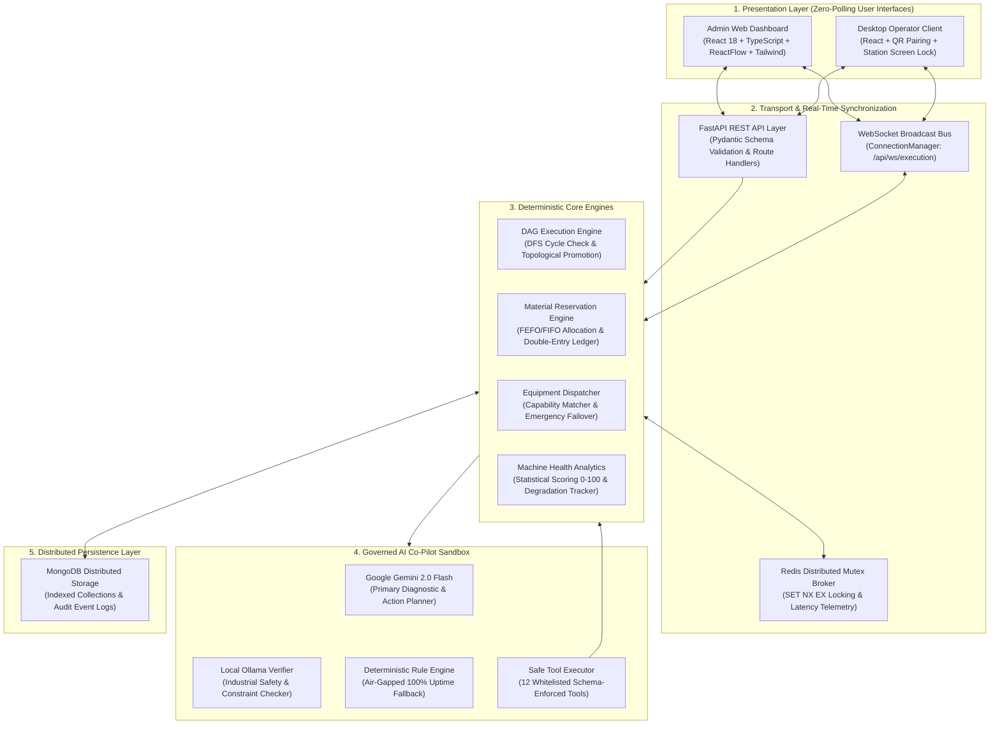
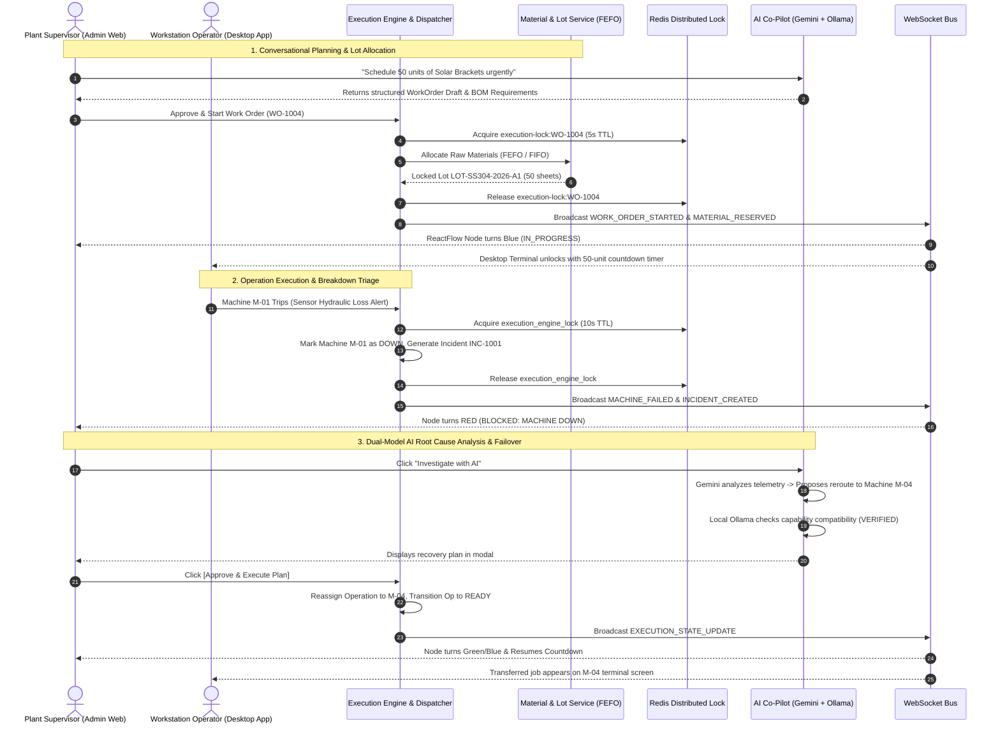

# Adaptive Manufacturing Execution System (MES)
## Comprehensive Project Overview, Architecture, Technical Decisions & Engineering Challenges

---

# Table of Contents
1. [Executive Summary: What We Built & How It Works](#1-executive-summary-what-we-built--how-it-works)
2. [High-Level System Architecture](#2-high-level-system-architecture)
3. [Key Features & Subsystems](#3-key-features--subsystems)
   - [3.1 Dynamic DAG Workflow & Topological State Engine](#31-dynamic-dag-workflow--topological-state-engine)
   - [3.2 Raw Material Lot Traceability & Double-Entry Ledger (Phase 6)](#32-raw-material-lot-traceability--double-entry-ledger-phase-6)
   - [3.3 Abstracted Equipment Capabilities & Dynamic Failover](#33-abstracted-equipment-capabilities--dynamic-failover)
   - [3.4 Predictive Maintenance & Statistical Machine Health (Phase 8)](#34-predictive-maintenance--statistical-machine-health-phase-8)
   - [3.5 Sandboxed Multi-Tier AI Co-Pilot (Gemini + Ollama)](#35-sandboxed-multi-tier-ai-co-pilot-gemini--ollama)
   - [3.6 Desktop Operator Client & Zero-Trust Station Security](#36-desktop-operator-client--zero-trust-station-security)
   - [3.7 Real-Time Synchronization & Distributed Mutex Locks](#37-real-time-synchronization--distributed-mutex-locks)
   - [3.8 Factory KPI Analytics & Live OEE Engine](#38-factory-kpi-analytics--live-oee-engine)
4. [Key Technical Decisions & Architectural Rationale](#4-key-technical-decisions--architectural-rationale)
5. [Complex Engineering Challenges & How We Solved Them](#5-complex-engineering-challenges--how-we-solved-them)
6. [End-to-End Operational Walkthrough](#6-end-to-end-operational-walkthrough)
7. [Technology Stack Summary](#7-technology-stack-summary)

---

# 1. Executive Summary: What We Built & How It Works

### The Problem
Traditional Manufacturing Execution Systems (MES) in discrete factories suffer from critical structural weaknesses:
* **Rigid Sequential Routing**: Workflows are hardcoded linear step lists tied to fixed machine serial numbers, causing catastrophic bottlenecks when equipment breaks down.
* **Coarse Inventory Tracking**: Material is tracked as single static numbers without metallurgical heat, supplier batch, or shelf-life lot segregation, making recall containment slow and expensive.
* **Unsynchronized Concurrency**: Shop-floor terminals and background polling loops frequently experience race conditions, leading to double-deducted inventory and flickering interfaces.
* **Risky AI Deployments**: Unconstrained LLM integrations with raw database access introduce hallucinations, dangerous machine parameter overrides, and unverified mutations.

### What We Built
**Adaptive MES** is an enterprise-grade, distributed discrete manufacturing execution platform that unifies shop-floor machinery, workstation operators, warehouse inventory, quality assurance, and executive management into an intelligent, resilient, real-time ecosystem.

```
+───────────────────────────────────────────────────────────────────────────────────────────────────+
|                                    HOW ADAPTIVE MES WORKS END-TO-END                              |
+───────────────────────────────────────────────────────────────────────────────────────────────────+
|                                                                                                   |
|  1. RECIPE & BATCH PLANNING                                                                       |
|     Supervisors design non-linear DAG workflows or use a Conversational AI Assistant to schedule  |
|     production batches in natural language.                                                       |
|                                                                                                   |
|  2. ATOMIC LOT ALLOCATION (FEFO / FIFO)                                                           |
|     When a Work Order starts, raw material lots are locked using database-level atomic Compare-   |
|     And-Swap (CAS) operations, prioritizing earliest-expiring lots.                              |
|                                                                                                   |
|  3. REAL-TIME TOPOLOGICAL EXECUTION                                                               |
|     A 1-second asynchronous engine loop evaluates graph dependencies, matches operations to       |
|     certified equipment capabilities, and streams countdown timers to operator screens.           |
|                                                                                                   |
|  4. CONTINUOUS HEALTH MONITORING & DYNAMIC FAILOVER                                               |
|     Telemetry analytics track cycle time elongation and MTBF/MTTR. If a machine breaks down, the  |
|     system freezes scheduling via Redis mutexes, queries idle backup workstations, and uses       |
|     Gemini + Ollama to propose a 1-click verified reroute.                                        |
|                                                                                                   |
|  5. IMMUTABLE AUDIT & DOUBLE-ENTRY LEDGER                                                         |
|     Every raw material movement, machine state transition, and supervisor action is written to an |
|     append-only transaction ledger, providing 100% forward and backward genealogy traceability.   |
|                                                                                                   |
+───────────────────────────────────────────────────────────────────────────────────────────────────+
```

---

# 2. High-Level System Architecture

Adaptive MES is architected into **five decoupled, highly specialized layers**:



---

# 3. Key Features & Subsystems

---

## 3.1 Dynamic DAG Workflow & Topological State Engine
* **Non-Linear Graph Modeling**: Operations are modeled as a Directed Acyclic Graph $G=(V, E)$, enabling parallel manufacturing branches (forks) and multi-parent assembly merging (joins).
* **DFS Cycle Detection ($\mathcal{O}(|V|+|E|)$)**: Runs a Depth-First Search with a recursion stack tracker (`rec_stack`) to mathematically prove acyclicity before saving workflows.
* **Topological Dependency Resolution**: Nodes in the `PENDING` state are automatically promoted to `READY` when all predecessor operations reach `COMPLETED`.
* **Dynamic Join Input Sizing**: Automatically computes input quantities for assembly nodes based on predecessor output yields:
  $$\text{InputQuantity}(Op_{\text{join}}) = \min_{u \in \text{Predecessors}} \left( \text{OutputQuantity}(Op_u) \right)$$
* **In-Place Canvas Animation**: Live ReactFlow canvas updates node countdown timers (`42s remaining`), SVG progress circles, and blockage banners without full-canvas re-renders.

---

## 3.2 Raw Material Lot Traceability & Double-Entry Ledger (Phase 6)
* **Lot-Level Segregation**: Tracks unique physical inventory lots with supplier batch codes, metallurgical heat numbers, storage bay coordinates, expiration dates, and unit acquisition costs.
* **3-Tier Stock Equation**: Dynamic, non-drifting stock calculation:
  $$\text{QuantityAvailable} = \max\left(0, \quad \text{QuantityOnHand} - \text{QuantityReserved}\right)$$
* **FEFO / FIFO Prioritization**: Sorts lots by compound key $(\text{ExpiryDate} \lor \infty, \text{ReceivedDate} \lor 0, \text{LotId})$, ensuring perishable materials are consumed first.
* **Atomic Compare-And-Swap (CAS) Locks**: Database-level conditional updates eliminate double-allocation race conditions across parallel work orders.
* **All-or-Nothing Shortage Rollback**: Automatically releases partial locks if warehouse stock is insufficient for a work order BOM, transitioning the batch to `WAITING_FOR_MATERIAL`.
* **Pro-Rata Multi-Lot Consumption & Actual Costing**: Deducts inventory pro-rata across multiple lots upon operation completion and calculates exact batch material costs.
* **Bidirectional Supply Chain Genealogy**:
  * *Backward Traceability*: Finished Product Serial $\to$ Work Order $\to$ Raw Material Heat Lot & Supplier.
  * *Forward Traceability*: Defective Raw Material Lot $\to$ All Affected In-Flight Batches & Customer Shipments (instant recall containment).

---

## 3.3 Abstracted Equipment Capabilities & Dynamic Failover
* **Decoupled Recipe Architecture**: Workflows specify required capabilities (`CUTTING`, `BENDING`, `WELDING`, `MILLING`, `PAINTING`, `INSPECTION`) rather than physical machine serial numbers.
* **Multi-Purpose Machine Dispatching**: Advanced 5-axis CNC machines supporting multiple capabilities can be shared dynamically across different production workflows.
* **Atomic Emergency Breakdown Pipeline**: When a machine trips, `MachineService.fail_machine()` acquires a global Redis lock, sets the machine to `DOWN`, pauses running batches, and searches for idle backup workstations (e.g. `M-04`).
* **Automated Maintenance Auto-Recovery**: Machines scheduled for repair automatically return to `IDLE` and resolve incident records as soon as their maintenance countdown window elapses.

---

## 3.4 Predictive Maintenance & Statistical Machine Health (Phase 8)
* **Continuous Health Scoring ($0 - 100$)**: Evaluates real-time telemetry against statistical baselines using a 4-factor deduction model:
  $$\text{Health Score } (H) = \max\left(0, \quad 100 - (P_{\text{cycle}} + P_{\text{failure}} + P_{\text{downtime}} + P_{\text{age}})\right)$$
* **Cycle Time Elongation Analytics**: Monitors percentage deviation $\Delta T\%$ against rated machine processing speeds to catch mechanical wear before failure.
* **Dynamic Reliability Metrics**: Continuous calculation of Mean Time Between Failures ($\text{MTBF}$) and Mean Time to Repair ($\text{MTTR}$).
* **AI Predictive Reasoner**: Google Gemini correlates wear patterns with component degradation to generate structured maintenance action plans with 1-click scheduling.

---

## 3.5 Sandboxed Multi-Tier AI Co-Pilot (Gemini + Ollama)
* **Zero-Direct-Database-Access Safety**: LLMs are isolated from raw database queries. The AI operates strictly as a cognitive advisor over **12 whitelisted schema-validated safe tools** (4 Read-Only inspection tools, 8 State Mutation tools).
* **Triple-Tier Model Hierarchy**:
  1. *Primary Engine*: Google Gemini 2.0 Flash (high-speed multi-step diagnostic reasoning).
  2. *Secondary Safety Verifier & Offline Fallback*: Local Ollama (cross-checks plans against plant safety rules; acts as air-gapped fallback).
  3. *Tertiary Fallback*: Deterministic Heuristic Rule Engine (guarantees 100% uptime if all LLMs are unreachable).
* **Mandatory Human-in-the-Loop Barrier**: AI-generated recovery plans are presented to plant supervisors in the Admin Web UI. No shop-floor mutations execute until the supervisor clicks `[Approve & Execute Plan]`.

---

## 3.6 Desktop Operator Client & Zero-Trust Station Security
* **Zero-Trust Station Lock**: Ruggedized desktop terminals remain locked until paired by a certified supervisor.
* **Cryptographic QR / Code Pairing**: Terminals receive 32-byte cryptographic session tokens (`sess_...`) validated via custom `X-Operator-Session` HTTP headers.
* **Persistent Login & Offline Reboot Resilience**: `localStorage` session state preserves logins across workstation power cycles and network drops without re-entering codes.
* **Focused Operator Dashboard**: Operators see only their assigned machine, live countdown timer, and input quantities.
* **1-Click Problem Dispatch**: Immediate emergency alert button logging shop-floor issues, setting machines `DOWN`, and alerting supervisors.

---

## 3.7 Real-Time Synchronization & Distributed Mutex Locks
* **Redis Distributed Mutex Locks (`SET NX EX`)**:
  * `execution-lock:{work_order_id}` (5s TTL): Eliminates race conditions between 1-second automated ticks and operator clicks.
  * `execution_engine_lock` (10s TTL): Prevents split-brain machine double-bookings during emergency failovers.
* **Zero-Polling WebSocket Bus**: Pushes 14 distinct real-time event types concurrently to all connected clients, eliminating inefficient polling loops.
* **React StrictMode Safety**: Standardized deferred unmount guards preventing broken socket warnings in development environments.

---

## 3.8 Factory KPI Analytics & Live OEE Engine
* **Overall Equipment Effectiveness (OEE)**: Mathematically computes plant productivity:
  $$\text{OEE} = \text{Availability } (A) \times \text{Performance } (P) \times \text{Quality } (Q)$$
* **Real-Time Executive Gauges**: Live visualization of plant-wide OEE, active workstation digital twins, total units produced, and scrap rate percentages.
* **Compliance Audit Trail**: Append-only log in `db.audit_events` satisfying ISO 9001 and FDA 21 CFR Part 11 traceability standards.

---

# 4. Key Technical Decisions & Architectural Rationale

```
┌───────────────────────────────────────────────┬───────────────────────────────────────────────┬────────────────────────────────────────────────────────────┐
│ Technical Decision                            │ Alternative Considered                        │ Engineering Rationale & Justification                      │
├───────────────────────────────────────────────┼───────────────────────────────────────────────┼────────────────────────────────────────────────────────────┤
│ **DAG Graph Modeling**                        │ Rigid Linear Step Lists                       │ Discrete manufacturing requires parallel subassembly paths │
│                                               │                                               │ and multi-parent joins that linear models cannot represent.│
├───────────────────────────────────────────────┼───────────────────────────────────────────────┼────────────────────────────────────────────────────────────┤
│ **Zero-Direct-Access AI Sandbox**             │ Direct Text-to-SQL / Text-to-Mongo            │ Unconstrained LLMs executing raw DB updates can hallucinate│
│                                               │                                               │ dangerous machine parameters or corrupt financial ledgers. │
├───────────────────────────────────────────────┼───────────────────────────────────────────────┼────────────────────────────────────────────────────────────┤
│ **Dual-Model Verification (Gemini + Ollama)** │ Single Cloud LLM Provider                     │ Cloud API provides speed and reasoning; local Ollama adds  │
│                                               │                                               │ independent safety verification and air-gapped resilience. │
├───────────────────────────────────────────────┼───────────────────────────────────────────────┼────────────────────────────────────────────────────────────┤
│ **Redis Distributed Mutex Locks (`SET NX EX`)**│ In-Memory Python Locks / DB Polling           │ Process-level locks fail across multi-worker deployments;  │
│                                               │                                               │ Redis locks provide millisecond-precision mutual exclusion.│
├───────────────────────────────────────────────┼───────────────────────────────────────────────┼────────────────────────────────────────────────────────────┤
│ **Atomic CAS Inventory Allocation**           │ Read-Modify-Write in Application Code         │ Application-level read-modify-write causes stock allocation│
│                                               │                                               │ race conditions under concurrent work order starts.        │
├───────────────────────────────────────────────┼───────────────────────────────────────────────┼────────────────────────────────────────────────────────────┤
│ **In-Place WebSocket UI Canvas Updates**      │ Full Canvas Layout Re-renders / HTTP Polling  │ Polling wastes network bandwidth and causes UI timer jumps;│
│                                               │                                               │ in-place mutation provides seamless 60fps countdowns.      │
└───────────────────────────────────────────────┴───────────────────────────────────────────────┴────────────────────────────────────────────────────────────┘
```

---

# 5. Complex Engineering Challenges & How We Solved Them

---

### Challenge 1: Preventing Circular Dependency Deadlocks in User-Created Graphs
* **The Problem**: Process engineers or AI conversational agents could accidentally configure cyclical workflows ($OP_{10} \to OP_{20} \to OP_{30} \to OP_{10}$). In production, this would cause infinite deadlocks where no operation could ever start.
* **Our Solution**: Implemented a formal Depth-First Search cycle detection algorithm using a recursion call stack (`rec_stack`) in `WorkflowService.validate_workflow_operations()`. If a node points back to an active ancestor in the recursion path, the request is immediately halted with `HTTP 400 Bad Request: Circular dependency cycle detected: OP-10 -> OP-20 -> OP-30 -> OP-10`.

---

### Challenge 2: Asynchronous Race Conditions on Rapid Engine Ticks & Operator Clicks
* **The Problem**: The backend execution engine ticks every 1 second across all active work orders. If an operator clicks "Finish Step" at the exact same millisecond that the 1-second timer expires, two concurrent execution threads would process completion simultaneously, causing **double material inventory deductions** and conflicting WebSocket state broadcasts.
* **Our Solution**: Implemented Redis per-work-order mutex locks (`execution-lock:{wo_id}`) with a 5-second TTL. The first thread to arrive acquires the lock; any concurrent thread arriving in that millisecond receives `False`, logs a clean skip, and yields execution.

---

### Challenge 3: Split-Brain Machine Allocations During Emergency Breakdown Failover
* **The Problem**: When a machine fails, `MachineService.fail_machine()` must pause running operations and find an idle backup machine. If a regular background tick ran while this failover calculation was in progress, it could assign another work order to that same backup machine, resulting in two batches claiming the same workstation.
* **Our Solution**: Implemented a global `execution_engine_lock` (10s TTL) acquired at the start of `fail_machine()`. This temporarily freezes the plant scheduling engine for a few milliseconds, cleanly reroutes the job, and releases the lock.

---

### Challenge 4: Partial Inventory Allocation Shortages & Stranded Locks
* **The Problem**: A Work Order requires 3 different materials. If Material A and Material B are available but Material C has insufficient stock, standard sequential locking leaves Materials A and B locked in the warehouse, preventing other work orders from using them.
* **Our Solution**: Implemented an all-or-nothing CAS allocation algorithm in `MaterialReservationService.allocate_and_reserve()`. If any required material in the BOM cannot be fulfilled, the service immediately executes a reverse rollback pass, decrements `quantityReserved`, deletes the partial reservation records, logs `RESERVATION_RELEASED` in the ledger, and sets the Work Order status to `WAITING_FOR_MATERIAL`.

---

### Challenge 5: React StrictMode WebSocket Connection Churn
* **The Problem**: React 18 in development mode mounts, unmounts, and re-mounts components in rapid succession. Early WebSocket implementations threw `WebSocket is closed before the connection is established` console errors during component unmounting.
* **Our Solution**: Implemented deferred lifecycle cleanup guards across all frontend pages (`WorkflowDesignerPage.tsx`, `WorkOrdersPage.tsx`, `Dashboard.tsx`). If the socket is in `WebSocket.CONNECTING` state during unmount, the close command is safely deferred to `ws.onopen = () => ws.close()`.

---

### Challenge 6: Desktop Terminal Offline & Reboot Resilience
* **The Problem**: Shop-floor terminals frequently experience power flickers or network drops. Forcing operators to call supervisors to re-generate activation codes after every reboot disrupts production.
* **Our Solution**: Combined 32-byte cryptographic session tokens (`sess_...`) with browser `localStorage` persistence and offline grace states in `operator-client/src/App.tsx`. Reopening the terminal synchronously reads the token, verifies status via `/api/operator-activations/status/{token}`, and immediately restores the active workstation screen.

---

# 6. End-to-End Operational Walkthrough



---

# 7. Technology Stack Summary

```
+───────────────────────────────────────────────────────────────────────────────────────────────────+
|                                      COMPLETE TECHNOLOGY STACK                                    |
+───────────────────────────────────────────────────────────────────────────────────────────────────+
|                                                                                                   |
|  FRONTEND APPLICATIONS (Admin Web & Operator Client)                                              |
|  • Framework: React 18, TypeScript, Vite                                                          |
|  • Visual Workflows: ReactFlow (@xyflow/react) with custom animated nodes                         |
|  • Styling & Icons: TailwindCSS, Lucide React, Glassmorphism design system                        |
|  • Real-Time Transport: Native WebSocket API with deferred StrictMode lifecycle guards           |
|                                                                                                   |
|  BACKEND API & DISTRIBUTED CORE                                                                   |
|  • Framework: FastAPI (Python 3.11+), Starlette, Uvicorn ASGI                                     |
|  • Data Validation: Pydantic v2 BaseModels with strict schema enforcement                        |
|  • Database Driver: Motor (Async Asynchronous MongoDB Python Driver)                              |
|  • Message Broker & Mutex: Redis (aioredis) for distributed atomic locking & latency health       |
|                                                                                                   |
|  AI CO-PILOT & VERIFICATION STACK                                                                 |
|  • Primary Reasoning: Google Gemini API (gemini-2.0-flash / gemini-1.5-pro)                       |
|  • Local Safety Verifier: Ollama REST Client (llama3.2 / mistral)                                 |
|  • Fallback Engine: Deterministic Python Heuristic Rule Engine                                    |
|  • Sandbox Enforcement: Safe Tool Registry (12 whitelisted Pydantic tools)                        |
|                                                                                                   |
|  DATABASE & AUDIT REPOSITORY                                                                      |
|  • Primary Database: MongoDB 7.0+ Distributed Document Store                                     |
|  • Collections: 19 indexed collections with strict unique constraints and append-only ledgers     |
|                                                                                                   |
+───────────────────────────────────────────────────────────────────────────────────────────────────+
```
